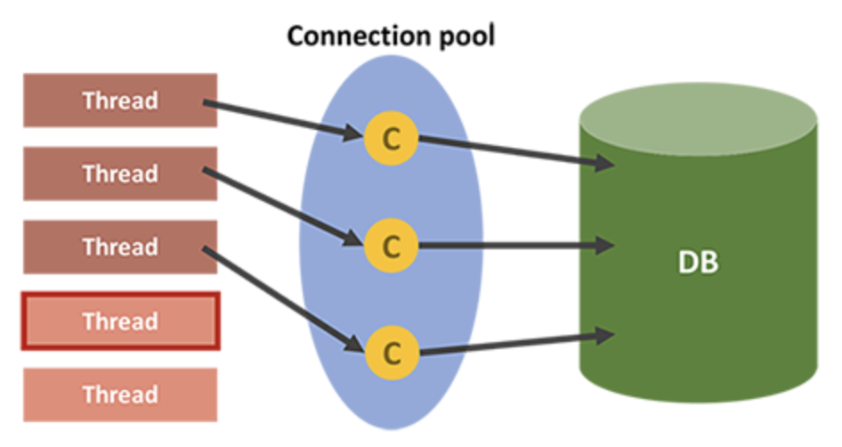

# 데이터베이스 풀

## 데이베이스 접근 과정

1. 클라이언트가 서버측에 DB 접근이 필요한 요청을 했다면, DB로 쿼리문을 날린다.
2. **웹서버가 DB서버에 접근하기 위해서는 DB Connection 객체를 생성하여 접근**한다.

이 때, 웹 서버에서 **DB서버에 최초로 연결되어 Connection 객체를 생성할 때가 가장 오래걸린다.**

DB Connection 객체를 생성하는 비용과 시간을 줄이고, 네트워크 연결에 대한 부담을 줄이고자 데이터베이스 풀을 사용한다. 데이터베이스 풀은 사전에 Connection 객체들을 생성하여 데이터베이스 풀에 보관하고 필요 시에 사용한다.

## 데이터베이스 풀이란?

- 클라이언트의 요청에 따라 (스레드에서) 데이터베이스에 접근하기 위한 Connection들을 모아두는 공간 혹은 이러한 기법을 뜻한다.
- Connection Pool 동작 과정
  - WAS가 실행되면서 **미리 일정량의 DB Connection 객체를 생성**하고 **Pool이라는 공간에 저장**해둔다.
  - HTTP 요청에 따라 **필요할 때 (DB 접근 필요시) Pool에서 Connection 객체를 가져다 쓰고 반환**한다.
  - 이와 같은 방식으로 HTTP 요청 마다 DB Driver를 로드하고 물리적인 연결에 의한 Connection 객체를 생성하는 비용이 줄어들게 된다.

**장점**

- **매 연결마다** Connection 객체를 생성하고 소멸시키는 비용을 줄일 수 있다.
- **미리 생성된 Connection 객체**를 사용하기 때문에 DB 접근 시간이 단축된다.
- DB에 접근하는 **Connection 수를 제한**하여, 메모리와 DB에 걸리는 **부하를 조정**할 수 있다.

## 스레드 풀이란?

매 요청마다 요청을 처리할 Thread를 만드는 것이 아닌, 미리 생성한 Pool 내의 Thread를 소멸시키지 않고 재사용하여 효율적으로 자원을 활용하는 기법이다.

**Thread Pool과 Connection Pool**

- Thread와 DB Connection의 개수는 성능에 직접적인 영향을 주기에 **적절한 수로 관리해야 한다.**
- 많이 사용하면 할 수록 메모리를 많이 점유하게 된다.
- **메모리를 위해 적게 지정한다면, 서버에서는 많은 요청을 처리하지 못하고 대기할 수 밖에 없다.**
- **Thread의 개수 > DB Connection의 개수**이어야 효율적이다. -> 그 이유는 애플리케이션에 대한 **모든 요청이 DB에 접근하는 것은 아니기 때문**이다.

