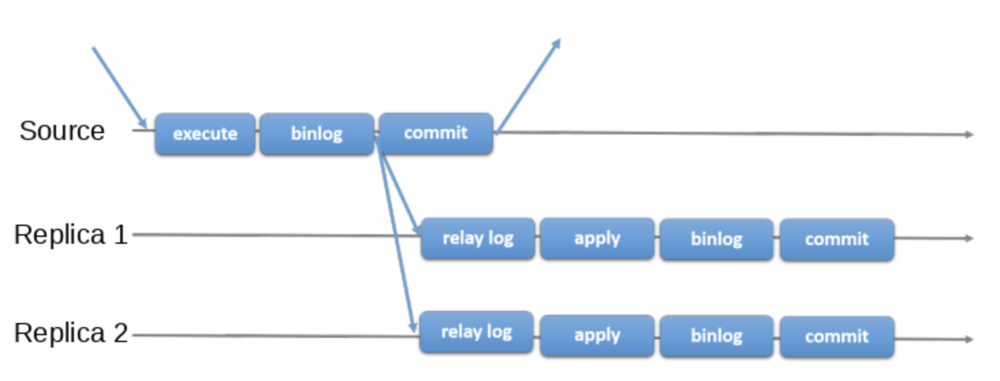
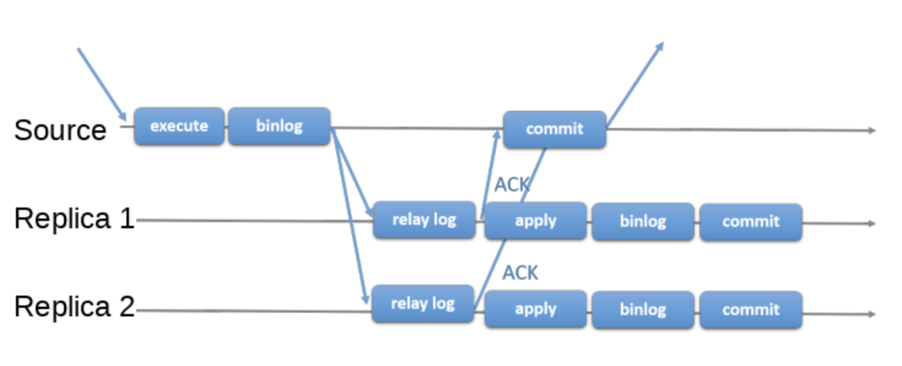

# Replication

## 정의

- MySQL이 **확장성을 위해 제공**하는 기술 중 가장 일반적인 방법이다.
- **2대 이상의 MySQL 서버가 동일한 데이터를 담도록 실시간으로 동기화**하는 기술

## 목적

- 고가용성
- ReadWrite Query와 ReadOnly 쿼리를 구분하여 수행하여 DB의 부하를 분산시킨다.
- 백업을 수행한다.

## Master & Slave

|Master|Slave|
|---|---|
|복제 대상 서버|복제하는 서버|
|INSERT나 UPDATE와 같은 쿼리로 **데이터를 변경할 수 있는** 서버|SELECT 쿼리로 **데이터를 읽기만 할 수 있는** 서버|
|Binary Log|Relay Log|

### Master

- 기술적으로는 MySQL의 **바이너리 로그가 활성화**되면 어떤 MySQL 서버든 마스터가 된다.
- 그러나 복제에 참여하는 여러 서버 가운데 **변경이 허용되는 서버**를 마스터로 한정한다.
- 마스터 서버에서 실행되는 DML과 DDL 가운데 데이터의 구조나 내용을 변경하는 모든 쿼리 문장을 바이너리 로그에 기록된다.
- 슬레이브 서버에서 변경 내역을 요청하면 마스터 서버는 바이너리 로그를 읽어 슬레이브로 넘긴다.
- 바이너리 로그를 안정적으로 기록하기 위해 **갭 락을 유지**하고, **매 트랜잭션이 커밋될 때마다 데이터를 변경시킨 쿼리 문장을 바이너리 로그에 기록**해야 한다.

### Slave

- 바이너리 로그를 받아 올 **마스터의 정보를 가지고 있는 경우** 슬레이브 서버가 된다.
- 일반적으로 마스터와 슬레이브의 데이터를 동일한 상태로 유지하기 위해 슬레이브 서버는 **읽기 전용**으로 설정하는 경우가 많다.
- 슬레이브 서버의 `I/O 스레드`는 마스터 서버에 접속해 변경 내역을 요청하고, 받아온 변경 내역을 `Relay Log`에 저장한다.
- 슬레이브 서버의 `SQL 스레드`가 Relay Log에 기록된 변경내역을 재실행함으로써 슬레이브의 데이터를 마스터와 동일한 상태로 유지한다.
- **하나의 슬레이브는 하나의 마스터**만 가질 수 있다.
- 마스터 서버에서 수많은 동시 사용자가 실행한 데이터 변경 쿼리 문장이 **슬레이브 서버에서는 하나의 스레드로 모두 처리되어야 한다.**
  - 따라서 **변경이 잦은** MySQL 서버일수록 마스터 서버보다 **슬레이브 서버의 사양이 더 좋아야 한다.**
  - 슬레이브에서는 마스터에서 동시에 여러 개의 스레드로 실행된 쿼리를 지연시키지 않고 하나의 스레드로 처리될 수 있게 된다.

## 복제 방식

1. Async Replication

MySQL의 기본 복제 방식이다.

Master 서버의 Binary Log에 모든 변경 사항이 기록되고, **Slave 서버에서 이 Binary Log를 이용하여 복제를 수행**하는 방식이다.

복제 과정에서 `비동기` 방식으로 동작하기 때문에 **Master에서는 Slave의 복제 여부 등을 확인하지 않고 Master 서버에서 실행중인 트랜잭션을 종료하고 결과를 반환**한다.

변경량이나 Slave의 부하 정도, 시스템 사용률, 네트워크 속도 등 여러가지 이유로 Slave에 복제가 늦어질 수 있다.

복제가 늦어지면 조회 시점에 따라서 데이터에 차이가 발생할 수 있다. 따라서 Master & Slave 간의 Gap을 줄이는게 중요하다.

2. Semi-sync Replication

MySQL 5.5 버전에서 도입된 복제 방식이다. **슬레이브의 relay log에 기록이 완료되었다는 메시지(신호)를 받아야만 처리중인 트랜잭션의 결과를 반환**하는 방식이다.

Async 방식에 비하면 **성능이 조금 저하**되지만, 완전한 sync(slave에서 relay log 내용까지 적용되는) 방식보다는 성능 저하가 덜하다.

Slave 측까지 변경 이력이 전달되었음을 보장하기 때문에 async 방식에 비해서 **Master와 slave 사이의 데이터 동기화나 안정성이 더욱 보장**된다.

