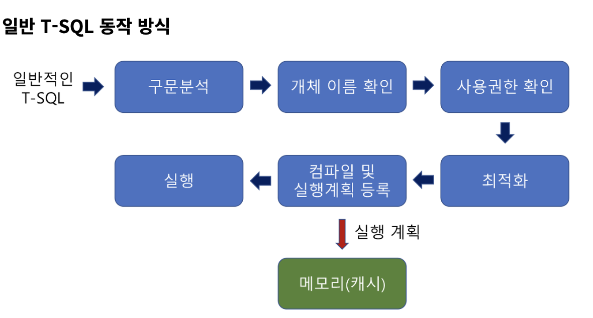

# 저장 프로시저(Stored Procedure)

실무에서는 프로그램에서 **만들어 놓은 SQL문을 저장해 놓고, 필요할때마다 호출**해서 사용하는 방식으로 프로그램을 만든다.

저장 프로시저는 이러한 방식이 가능하도록 하는 각 DBMS에서 제공하는 프로그래밍 기능이다.

대부분의 DBMS에서 제공하고 여기서는 MSSQL에서 제공하는 저장 프로시저에 대해 정리한다.

저장 프로시저는 쿼리문들의 집합으로, 어떤 동작으로 여러 쿼리를 거쳐서 일괄적으로 처리할 때 사용한다.

**그렇다면 그냥 SQL 문을 쓰면 되지 굳이 SP를 만들어 써야하나?** 라고 말할수도 있다.

저장 프로시저를 실무에서 사용하는 이유가 있다.

**먼저, SQL Server의 성능을 향상시킬 수 있다.**

저장 프로시저를 처음에 실행하면 최적화, 컴파일 단계를 거쳐 그 결과가 캐시(메모리)에 저장되게 되는데, **이후에 해당 SP를 실행하게 되면 캐시(메모리)에 있는 것을 가져와서 사용**하므로 실행속도가 빨라지게 된다.

그렇기 때문에 일반 쿼리를 반복해서 실행하는 것보다 SP를 사용하는게 성능적인 측면에서 좋다.

**두 번째, 유지보수 및 재활용 측면에서 좋다.**

C#, Java 등으로 만들어진 응용프로그램에서 직접 SQL문을 호출하지 않고 **저장 프로시저의 이름을 호출하도록 설정하여 사용**하는 경우가 많은데, 이 때 개발자는 수정 요건이 발생할 때 코드 내 SQL문을 건드리는게 아니라 SP 파일만 수정하면 되기 때문에 유지보수 측면에서 유리해진다.

또한 한번 저장 프로시저를 생성해 놓으면 언제든 실행이 가능하기 때문에 재활용 측면에서 매우 좋다.

**셋째, 보안을 강화할 수 있다.**

사용자별로 테이블에 권한을 주는게 아닌 **저장 프로시저에만 접근 권한을 주는 방식으로 보안을 강화**할 수 있다.

실제 테이블에 접근하여 다양한 조작을 하는 것은 위험하기 때문에 실무에서는 실제로 개발자에게는 sp권한만 주는 방식을 많이 사용한다.

## 일반적인 SQL문과 저장 프로시저 동작 방식 비교

저장 프로시저를 사용하면 보통 일반적인 T-SQL 사용보다 시스템의 성능이 향상된다고 한다.

그 이유는 무엇일까? 내부에서 처리되는 방식을 비교해보자.

### 일반 T-SQL 동작 방식



위의 그림은 일반적인 T-SQL 문을 처음으로 실행하면 위의 프로세스로 동작한다.

만약에 아래 쿼리를 실행한다고 가정하자.

```sql
SELECT name FROM userTb1;
```

그러면 먼저 구문 분석단계에서 구문 자체에 오류가 없는지 분석을 할 것이다. 만약 오타가 있으면 여기서 오류가 발생되어 에러메시지를 띄울 것이다.

다음은 개체 이름 확인 단계에서 userTbl 이라는 테이블이 현재 데이터베이스에 있는지 확인을 한다. 만약에 userTbl이 있으면 그 안에 name이라는 열이 있는지를 확인할 것이다.

그 다음 사용권한 확인 단계에서 userTbl을 현재 접근중인 사용자가 권한이 있는지를 확인한다.

다음으로 최적화 단계에서 해당 쿼리문이 가장 좋은 성능을 낼 수 있는 경로를 결정한다. 인덱스 사용 여부에 따라 경로가 결정된다고 보면 된다. 위의 쿼리의 경우 전체 데이터를 가져오기 때문에 아마도 테이블 스캔이나 클러스터 인덱스 스캔이 될 것이다.

다음은 최적화된 결과를 바탕으로 컴파일 및 실행 계획 등록 단계에서 해당 실행계획 결과를 메모리(캐시)에 등록한다.

그리고 컴파일된 결과를 실행한다.

단 한 줄의 쿼리지만 이렇게 많은 절차를 거친다..

**다음은 저장 프로시저 정의시에 동작 방식이다.**


일단 먼저 해당 저장 프로시저에 구문 오류가 있는 지를 파악하는 과정을 거친다.

다음은 지연된 이름 확인 과정을 거치게 되는데 이는 저장 프로시저의 특징중 하나이다.
저장 프로시저의 경우에는 프로시저를 정의하는 시점에 테이블과 같은 해당 개체의 존재 여부와 상관없이 정의가 가능한데, 그 이뉴느 해당 테이블의 존재 여부를 프로시저의 실행 시점에 확인하기 때문이다. 그렇기에 해당 테이블의 존재 여부와 상관없이 프로시저는 정의할 수 있다. 그런데 테이블의 열 이름이 틀리면 오류가 발생된다.

실무에서 없는 테이블을 프로시저 정의에 사용하는 등의 실수를 할 수 있으니 주의하자.

다음은 생성권한을 확인하는 단계인데 사용자가 저장 프로시저를 생성할 권한이 있는지를 확인하는 과정이다.

마지막으로 시스템 테이블 등록을 진행한다. 저장 프로시저의 이름과 코드가 관련 시스템 테이블에 등록되는 과정이다. 만약 관련 내용을 확인하고자 하면 카탈로그 뷰 sys.objects 및 sys.sql_modules 등을 확인하자.

**다음은 저장 프로시저를 처음 호출했을 때 동작이다.**


일반적인 쿼리를 수행하는 것과 비슷하다. 이는 첫 번째로 프로시저를 수행했을 때이고 그 이후에는 다음과 같이 메모리(캐시)에 있는 것을 그대로 가져와 재사용하게 되어 수행시간이 많이 단축되게 된다.


**다음 예시를 보면 이해가 빠를 것이다.**

다음과 같이 일반적인 쿼리 세 개를 수행하면 조건값이 다 다르므로 매번 최적화와 컴파일을 다시 수행한다.

```sql
SELECT * FROM userTbl WHERE name ='이승기';
SELECT * FROM userTbl WHERE name ='성시경';
SELECT * FROM userTbl WHERE name ='은지원';
```

하지만 저장 프로시저를 만들어서 수행하면 첫 번째 쿼리만 최적화와 컴파일을 수행하고 나머지는 메모리(캐시)에 있는것을 사용하게 된다.

```sql
CREATE PROC select_by_name
	@Name NVARCHAR(3)
AS
	SELECT * FROM userTbl WHERE name =@name;
```

```sql
EXEC select_by_name '이승기';
EXEC select_by_name '성시경';
EXEC select_by_name '은지원';
```

## 저장 프로시저의 문제점

그렇다면 저장 프로시저는 과연 만능의 성능을 자랑할까?

대부분의 경우에는 성능이 향상되나 항상 그렇지는 않다.

자세한 내용은 [여기](https://devkingdom.tistory.com/323)에서 살펴보자.