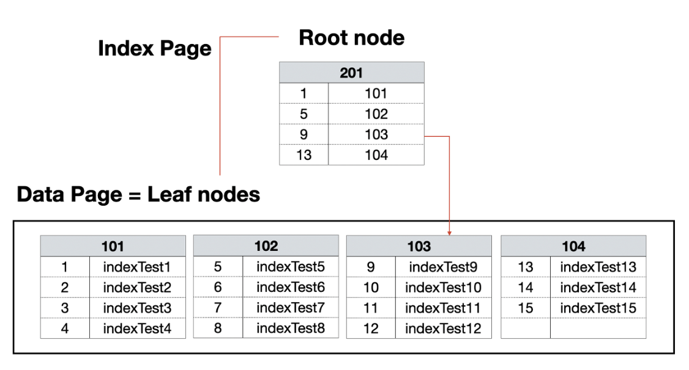
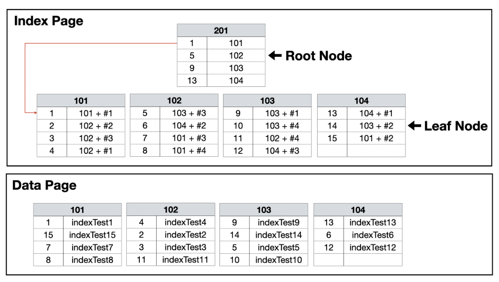

# Clustered Index & Non Clustered Index

**인덱스의 종류**

1. 클러스터형 인덱스(Clustered Index)
2. 넌 클러스터형 인덱스(Non-Clustered Index)

**클러스터 인덱스 특징**

- **테이블당 1개씩**만 허용된다.
- **물리적으로 행을 재배열**한다.
- **PK** 설정 시 그 컬럼은 **자동으로 클러스터드 인덱스가 만들어진다.**
- 인덱스 자체의 리프 페이지가 곧 데이터이다. 즉 테이블 자체가 인덱스이다. (따로 인덱스 페이지를 만들지 않는다.)
- 데이터 **입력, 수정, 삭제 시 항상 정렬 상태를 유지**한다.
- **비 클러스터형 인덱스보다 검색 속도는 더 빠르다.** 하지만 데이터의 **입력, 수정, 삭제는 느리다.**
- 30% 이내에서 사용해야 좋은 선택도를 가진다.

**넌 클러스터 인덱스 특징**

- **테이블당 약 240개**의 인덱스를 만들 수 있다.
- 인덱스 페이지는 **로그파일에 저장**된다.
- 레코드의 **원본은 정렬되지 않고, 인덱스 페이지만 정렬**된다.
- 인덱스 자체의 리프 페이지는 데이터가 아니라 데이터가 위치하는 포인터(RID)이기 때문에 **클러스터형보다 검색 속도는 더 느리지만 데이터의 입력, 수정, 삭제는 더 빠르다.**
- 인덱스를 생성할 때 데이터 페이지는 그냥 둔 상태에서 별도의 인덱스 페이지를 따로 만들기 때문에 용량을 더 차지한다.
- 3% 이내에서 사용해야 좋은 선택도를 가진다.

쉽게 책에 비유하자면 `클러스터 인덱스`는 **페이지를 알기 떄문에 바로 그 페이지를 펴는 것**이고, `넌 클러스터 인덱스`는 뒤에 **목차에서 찾고자 하는 내용의 페이지를 찾고 그 페이지로 이동하는 것**과 같다. 테이블 스캔은 처음부터 한 장씩 넘기면서 내용을 찾는 것과 같다.

## 클러스터 인덱스

클러스터형 인덱스를 구성하려면 **행 데이터를 해당 열로 정렬한 후에 루트 페이지를 만들게 됩니다.** 즉 데이터 페이지는 리프 노드와 같은 것을 확인할 수 있다.

## 넌 클러스터 인덱스

넌 클러스터형 인덱스는 데이터 페이지를 건들지 않고, **별도의 장소에 인덱스 페이지를 생성합**니다. 우선 인덱스 페이지의 리프 페이지에 인덱스로 구성한 열을 정렬하고 데이터 위치 포인터를 생성한다. 데이터의 위치 포인트는 클러스터형 인덱스와 달리 '페이지 번호 + #오프셋'이 기록되어 바로 데이터 위치를 가리킨다. indexTest2로 예를 들면 102번 페이지의 두번째(#2)에 데이터가 있다고 기록하게 된다. 그러므로 이 데이터 위치 포인터는 데이터가 위치한 고유한 값이 된다.

## 결론

클러스터 인덱스는 데이터 위치를 바로 알기 때문에 그 데이터로 바로 접근할 수 있고, 넌 클러스터 인덱스는 인덱스 페이지를 한번 거쳐서 데이터에 접근하는 방식이다.