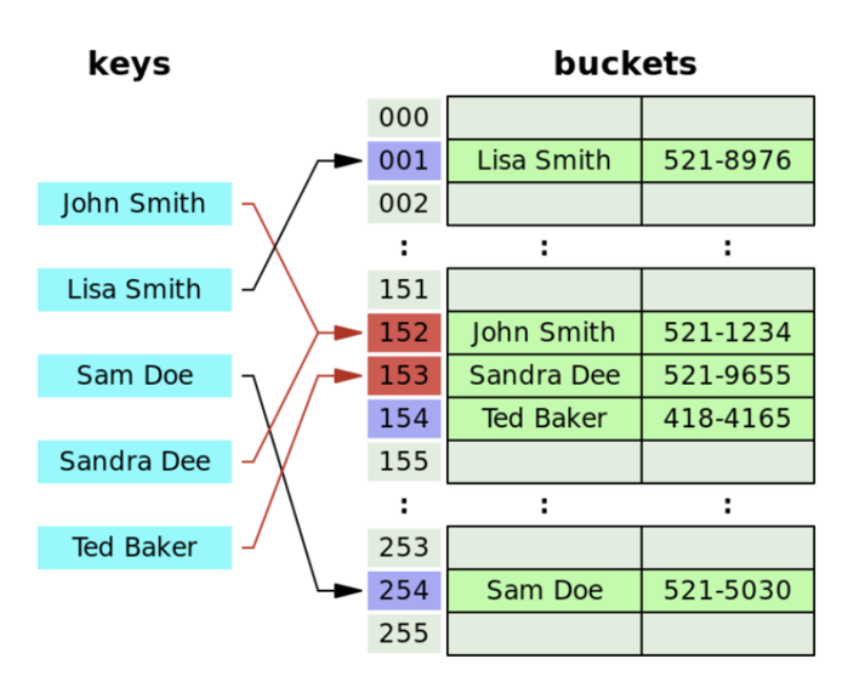

# Hash Table

- `key - value` 로 이루어진 자료구조이다.
- 이 때의 key는 해시함수를 사용하여 해시 값으로 매핑한 인덱스이다.
- **이 해시값을 색인(인덱스) 또는 주소 삼아** 데이터를 key와 함께 저장하는 자료구조이다.
- **Hash Function**
  - **키 값**을 입력받아 **해시 주소를 생성**한다.
  - key를 고정된 길이의 hash로 변경해주는 역할을 한다.
  - 만들어진 해시 주소가 해시 테이블의 인덱스가 된다.
- **검색 속도(해시 테이블의 가장 큰 장점)**
  - hash는 **내부적으로 배열을 사용하여 데이터를 저장**하기 때문에 빠른 검색 속도를 갖는다.
  - **해시 충돌이 일어나지 않는 경우**, 해시 테이블의 시간 복잡도는 `O(1)`이다.
  - **해시 충돌이 일어날 경우** 시간 복잡도는 `O(1)`이 **아니다.**

## 해시 충돌

**두 개의 다른 key가 동일한 hash값을 갖는 경우**를 말한다.

해시 함수로 해시를 만드는 과정에서 서로 다른 key가 같은 hash로 변경되면, 같은 공간에 2개의 value가 저장되므로 key-value가 1:1로 매핑되어야 하는 해시 테이블의 특성에 위배된다.

**해시 충돌은 필연적으로 나타날 수 밖에 없다.** Collision이 많아질수록 Search에 필요한 Time Complexity가 O(1)에서 O(n)에 가까워진다. -> 좋은 `hash function`을 선택하는 것은 **hash table의 성능 향상에 필수**적인 것이다.

**좋은 해시 함수의 기준?**

- 충돌이 적고(중복이 적고)
- 해시 함수 값이 해시 테이블의 주소 영역 내에서 고르게 분포되어야 하고
- 속도가 빨라야 좋은 해시 함수이다.

## 충돌 해결방법

1. Open Address (개방 주소법)

해시 충돌 발생시 해시 함수로 얻은 주소가 아닌 다른 해시 버킷에 해당 자료를 삽입하는 방식이다.

빈 버킷이 나올 때까지 탐색 후, 찾으면 해당 자료를 삽입한다.

**장점**

추가 저장 공간을 이용하지 않고 해시 테이블 내에서 데이터를 저장한다.

**단점**

데이터의 양이 늘어나면 새 저장소를 미리 확보해두어야 한다. (새로운 해시 테이블을 준비)

**시간 복잡도**

탐색, 삽입, 삭제 모두 최상의 경우 O(1), 최악의 경우 O(n)

**해결 기법**

선형 프로빙(Linear probing): **비어있는 인덱스를 선형적으로 탐색**하는 방식

이차식 프로빙(Quadratic probing): 배열을 **2차 함수꼴로 건너 뛰며 빈공간을 탐색**하는 방식

이중 해싱(Double Hashing, 재해싱): 위의 프로빙의 경우, 클러스터링 문제(데이터가 밀집) 발생하여 클러스터링 크기만큼 탐색 속도가 지연된다. 따라서 서로 다른 두 개의 해시 함수를 이용하여 충돌 시 간격을 결정하여 균일하게 저장한다.

2. Separate Chaining (체이닝)

- Linked List를 사용하는 방식
  - 각각의 버킷(bucket)들을 **연결리스트(Linked List)로 만들어 Collision이 발생하면 해당 bucket의 list에 추가**하는 방식이다.
  - 버킷을 계속해서 사용하는 Open Address 방식에 비해 **테이블의 확장을 늦출 수 있다.**
  - 장점: 연결 리스트의 특징을 그대로 이어받아 **삭제 또는 삽입이 간단**하다.
  - 단점: **연결 리스트 자체의 오버헤드**가 부담이 된다.
  - 시간 복잡도
    - 삽입: `O(1)`
    - 탐색이나 삭제: 키에 해당하는 리스트의 길이에 비례함, 최악의 경우 `O(K)` (K는 키 값의 개수)
- Tree를 사용하는 방식
  - 각각의 버킷(bucket)들을 트리를 사용하여 Collision이 발생하면 해당 bucket의 list에 추가하는 방식이다.
  - **연결 리스트 혹은 트리를 사용할 것인가에 대한 기준**은?
    - 하나의 해시 버킷에 할당된 key-value 쌍의 개수이다.
    - **데이터의 개수가 적다면 링크드 리스트를 사용하는 것이 맞다.**
    - 트리는 기본적으로 메모리 사용량이 많기 때문이다. 데이터의 개수가 적을 때 Worst Case를 살펴보면 트리와 링크드 리스트의 성능상 차이가 거의 없다.
    - 따라서 메모리 측면을 봤을 때 데이터의 개수가 적을 때는 링크드 리스트를 사용한다.

