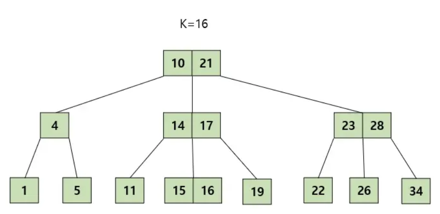

# B- tree

보통 B 트리라고 하면 B- 트리를 의미한다. B 트리는 트리 자료구조의 일종으로 이진트리를 확장해 하나의 노드가 가질 수 있는 자식 노드의 최대 숫자가 2보다 큰 트리 구조이다.

이러한 B 트리의 다음과 같은 특징을 그림과 함께 알아보자.

1. 노드에는 2개 이상의 데이터(Key)가 들어갈 수 있으며, **항상 정렬된 상태로 저장**된다.

위 그림처럼 한 노드에 2,3개의 데이터가 들어갈 수 있으며, 항상 정렬된 상태로 저장된다.

2. 내부 노드는 **M/2 ~ M개**의 자식을 가질 수 있다. 최대 M개의 자식을 가질 수 있는 B 트리를 M차 B트리라고 한다.

위 그림은 3차 B트리를 나타낸다. 즉, 3차 B트리의 리프노드를 제외한 내부 노드는 1개~3개의 자식을 가질 수 있다.

3. 특정 노드의 데이터(Key)가 K개라면, 자식 노드의 개수는 K+1개 여야 한다.

위 그림을 보면 특정 노드의 데이터가 2개면 자식 노드는 3개이고, 특정 노드의 데이터가 1개면 자식 노드는 2개이다.

4. 특정 노드의 왼쪽 서브 트리는 특정 노드의 Key 보다 작은 값들로, 오른쪽 서브 트리는 큰 값들로 구성된다.

B-트리는 노드내의 Key값이 2개 이상 들어갈 수 있기 때문에 자식 노드를 가리키는 포인터의 개수는 Key의 개수보다 1개가 더 많다. 따라서 노드내에서 Key가 a1,a2,a3... 등으로 존재한다면, a1 왼쪽 서브 트리는 a1보다 작아야 하고, a1과 a2 사이의 서브 트리는 a1보다는 크면서 a2보다는 작아야 한다.

예를 들어 위 그림을 보면 10의 왼쪽 서브 트리는 10보다 작은 값이 위치한다. (10,21) 사이의 서브트리는 10보다는 크지만 21보다는 작은 값들이 위치한다.

5. 노드 내에 데이터는 floor(M/2)-1개부터 최대 M-1개까지 포함될 수 있다.(floor: 내림 함수 Ex-floor(3.7) = 3)

여기서 floor는 내림 함수이다. 예를 들어 floor(3.6) = 3이다. 3차 B트리는 노드 내에 0~2개의 데이터를 가질 수 있다.

6. 모든 리프 노드들이 같은 레벨에 존재한다.

모든 리프 노드들은 같은 레벨에 존재해야 한다. 즉, 루트 노드에서 모든 리프 노드로 가는 경로의 길이가 같아야 한다.

위의 그림을 보면 하나의 리프 노드의 레벨이 다르다. 따라서 B-tree의 조건을 만족하지 않는다.

## B-tree 탐색과정

B-tree는 루트 노드에서 탐색을 시작하여 하향식으로 탐색을 진행한다. 찾고자 하는 값이 K라면 다음과 같은 과정을 거친다.

1. **루트 노드에서 탐색을 시작**한다.
2. **K를 찾았다면 탐색을 종료**한다.
3. K와 노드의 **Key 값을 비교해 알맞은 자식 노드로 내려간다.**
4. 해당 과정을 **리프 노드에 도달할 때까지 반복**한다.
5. 리프 노드에서도 K를 찾지 못한다면 트리에 값이 존재하지 않는 것이다.

예를들어 위와같은 트리에서 16을 찾는다고 하자.

가장 먼저 루트 노드에서 K와 Key값들을 비교한다. 그 결과 16은 10과 21사이의 값이기 때문에 10과 21 사이의 자식 포인터를 타고 내려간다.

내려와서 16은 또한 14와 17사이의 값이기 때문에 14와 17사이의 자식 포인터를 타고 내려간다.

마지막으로 리프 노드에서 해당 값을 탐색해서 16을 찾아낸다.

## B-tree 삽입과정

B-tree에 데이터를 삽입하는 과정은 탐색과는 다르게 **상향식**으로 진행된다. B- 에서의 데이터 삽입은 항상 리프노드에서 시작된다.

1. 트리가 비어있다면 루트 노드를 할당하고 K를 삽입한다.
2. 트리가 비어있지 않다면 데이터를 넣은 적절한 리프 노드를 탐색한다.
3. 리프 노드에 데이터를 넣고 리프 노드가 **적절한 상태에 있다면 종료**한다.
4. 리프 노드가 **부적절한 상태에 있다면 분리**한다.

이 때, 적절한 상태란 노드의 데이터 개수가 허용 범위 안에 있는것을 의미한다. 반대로 부적절한 상태란 해당 노드의 데이터 개수가 허용 범위를 벗어나 너무 많은 상태를 뜻한다.

### Case 1: 분리가 일어나지 않는 경우

1. 데이터를 삽입할 리프 노드를 탐색하고, 해당 노드에 데이터를 삽입한다.
2. 해당 노드가 적절한 상태에 있다면 삽입을 종료한다.

위와 같은 B-트리에 9를 삽입한다고 하자. 먼저 9를 넣을 노드를 탐색과정과 동일하게 탐색해서 찾는다.

K를 삽입할 리프 노드를 찾았다면, 해당 노드에 K를 삽입한다. 이 때 3차 트리는 한 노드에 최대 2개의 데이터를 담을 수 있으므로 리프 노드는 적절한 상태에 있으므로 삽입 과정을 종료한다.

### Case 2: 분리가 일어나는 경우

1. 데이터를 삽입할 리프 노드를 탐색하고, 해당 노드에 데이터를 삽입한다.
2. 해당 노드의 왼쪽 키들은 외쪽 자식으로, 오른쪽 키들은 오른쪽 자식으로 분리된다.
3. 부모 노드를 검사해 부모 노드가 부적절한 상태에 있다면 위와 같은 분리를 반복한다.

위와 같은 B-트리에 16을 삽입한다고 하자. 먼저 16을 넣을 노드를 탐색과정과 동일하게 탐색해서 찾는다.

K를 삽입할 리프노드를 찾았다면, 해당 노드에 K를 삽입한다. 이 때 3차 트리는 한 노드에 최대 2개의 데이터를 담을 수 있으므로 리프노드는 부적절한 상태에 있으므로 분리를 진행한다.

15는 왼쪽 자식으로 17은 오른쪽 자식으로 설정한다.

부모 노드가 다시 부적절한 상태가 되었으므로 분리를 진행한다.

중앙값 16을 부모 노드에 삽입한다.

14는 왼쪽 자식, 18은 오른쪽 자식으로 설정한다.

부모 노드가 다시 부적절한 상태가 되었으므로 분리를 진행한다.

중앙값 16을 부모 노드에 삽입할 수 없으니, 새로 노드를 생성한다.

10을 왼쪽 자식, 21을 오른쪽 자식으로 설정한다.

모든 노드가 적절한 상태에 있으므로 삽입을 종료한다.

## B-tree 삭제과정

삭제 과정은 복잡하니 다음 블로그를 참고하도록 하자.

[[자료구조] B-트리(B-Tree)란? B트리 그림으로 쉽게 이해하기, B트리 탐색, 삽입, 삭제 과정](https://code-lab1.tistory.com/217)