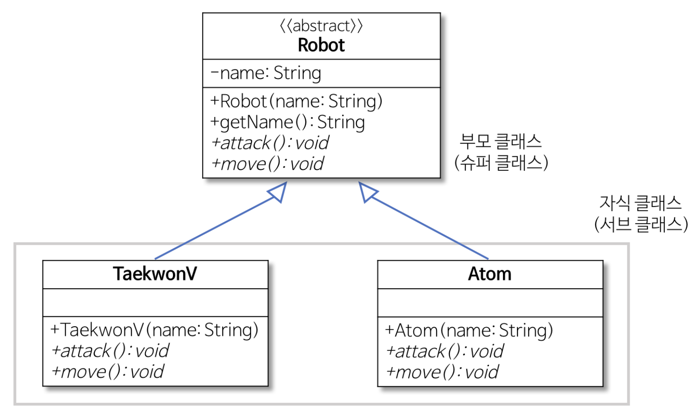
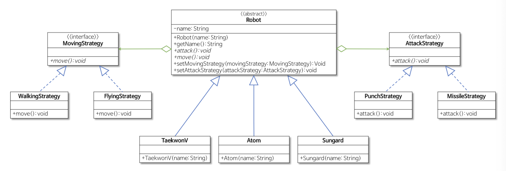

# Strategy pattern

> 행위를 클래스로 **캡슐화**해 동적으로 행위를 자유롭게 바꿀 수 있게 해주는 패턴

즉 객체들이 할 수 있는 행위를 전략으로 만들고(캡슐화를 하고, 클래스/인터페이스를 생성하고)

객체의 행위를 동적으로 바꾸고 싶은 경우 **행위를 수정하지 않고 전략을 바꿔주는 방법**

## 전략 패턴을 사용하는 이유?



```java
public class TaekwonV extends Robot {
  public TaekwonV(String name) { super(name); }
  public void attack() { System.out.println("I have strong punch."); }
  public void move() { System.out.println("I can only walk."); }
}

public class Atom extends Robot {
  public Atom(String name) { super(name); }
  public void attack() { System.out.println("I have strong punch."); }
  public void move() { System.out.println("I can fly."); }
}
```

여기서 만약 Atom 혹은 TaekwonV에 메소드를 추가/수정하고 싶은 경우, 직접 코드를 수정해야한다.

예를들어 Atom이 움직이는 방법을 바꾸고 싶다면, 직접 `move()` 메서드를 수정해야한다.

```java
public class Atom extends Robot {
  public Atom(String name) { super(name); }
  public void attack() { System.out.println("I have strong punch."); }  
  public void move() { System.out.println("I can only walk."); } // fly -> walk로 수정
}
```

이런식으로 직접 코드의 내용을 수정해야하므로 SOLID의 원칙 중 OCP에 위배된다.

또한, TaekwonV와 Atom의 `attack()` 메서드의 내용이 중복된다. -> 여러 클래스에서 같은 내용 코드를 모두 수정해야하는 상황이 되면 일일이 수정해주어야 한다. 뿐만 아니라 새로운 로봇을 추가하는 경우에도 중복 코드를 새롭게 작성해주어야 한다.

> OCP: **확장에 대해서는 개방(OPEN)되어야 하지만 변경에 대해서는 폐쇄(CLOSE)** 되어야 한다. 즉, 기존의 코드를 변경하지 않으면서 기능을 추가할 수 있도록 설계가 되어야 한다.

## 전략 패턴을 사용하기

이렇게 공통 기능들은 인터페이스로 캡슐화하고, 상속받아서 자식클래스에서 해당 기능들을 사용하는 방식이 전략 패턴이다..

위의 예제에서 문제가 되는 기능들은 `move()`, `attack()` 이었다. 이를 캡슐화하려면 각각의 인터페이스를 만들고 구체적인 방식은 실제 실현한 클래스에 담아야한다.



위 그림과 같이 `MovingStrategy` 와 `AttackStrategy` 인터페이스로 캡슐화하고, 실제 구현은 구체 클래스를 각각 `MovingStrategy`, `FlyingStrategy` 와 `MissileStrategy`, `PunchStrategy` 으로 구현해주었다.

이렇게 전략패턴으로 설계를 하게 되면

- 새로운 기능의 추가(새로운 이동, 공격 기능)가 기존의 코드에 영향을 미치지 못하게 하므로 OCP를 만족하는 설계가 된다.
  - 걷기가 필요하면 `MovingStrategy` 를 상속받는 `WalkingStrategy` 클래스를 만들면 된다.
- 전략을 수정할때도 클라이언트 코드에서 해당하는 전략만 바꿔주면 된다.

```java
public class Client {
  public static void main(String[] args) {
    Robot taekwonV = new TaekwonV("TaekwonV");
    Robot atom = new Atom("Atom");

    /* 수정된 부분: 전략 변경 방법 */
    taekwonV.setMovingStrategy(new WalkingStrategy());
    taekwonV.setAttackStrategy(new MissileStrategy());
    atom.setMovingStrategy(new FlyingStrategy());
    atom.setAttackStrategy(new PunchStrategy());

    /* 아래부터는 동일 */
    System.out.println("My name is " + taekwonV.getName());
    taekwonV.move();
    taekwonV.attack();

    System.out.println()
    System.out.println("My name is " + atom.getName());
    atom.move();
    atom.attack();
  }
}
```