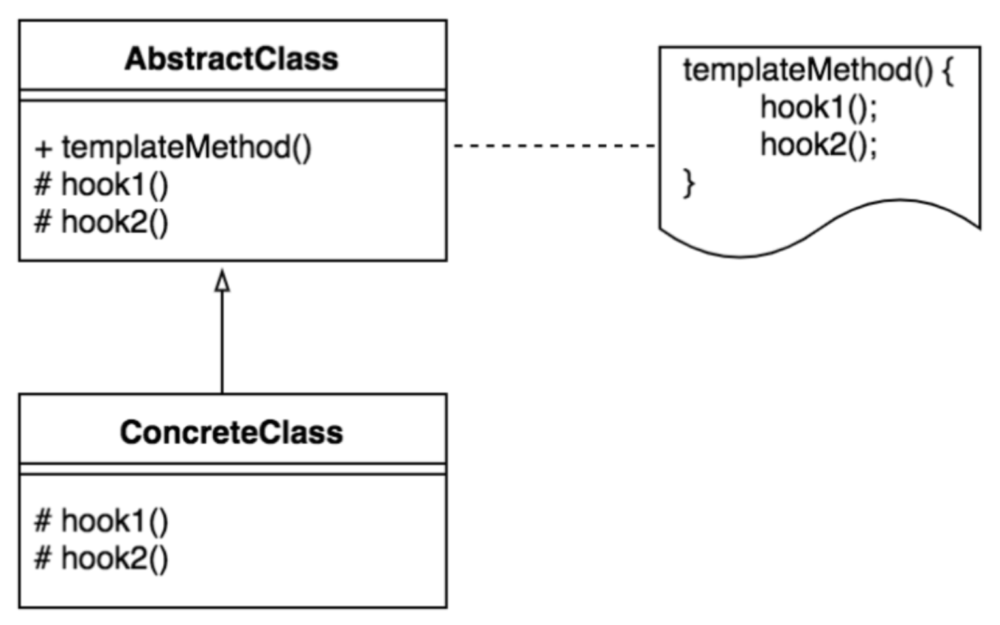

# 템플릿 메서드(Template Method Pattern) 패턴

템플릿 메서드 패턴이란 특정 작업을 처리하는 일부분을 서브 클래스로 캡슐화하여 전체적인 구조는 바꾸지 않으며, 특정 단계에서 수행하는 내용을 바꾸는 패턴을 의미한다.

예를들어 HTTP와 SMTP Client의 경우, 주고 받는 메시지의 내용이 다를뿐 둘 다 인터넷 프로토콜을 이용하여 서버에게 요청을 전달하고 결과를 수신한다는 점에서 동일하다.

이처럼 두 개 이상의 프로그램이 기본적으로 동일한 골격 하에서 동작할 때, **기본 골격에 해당하는 알고리즘은 일괄 관리**하면서 **각 프로그램마다 달라지는 부분에 대해서 따로 만들고 싶을 때 적용**한다.



- AbstractClass
  - **템플릿 메서드**를 정의하는 클래스
  - 하위 클래스에 공통 알고리즘을 정의하고 **하위 클래스에서 구현될 기능을 primitive 메서드 또는 hook 메서드로 정의하는 클래스**

- ConcreteClass
  - 물려받은 primitive 메서드 또는 hook 메서드를 **구현**하는 클래스
  - 상위 클래스에 구현된 템플릿 메서드의 일반적인 알고리즘에서 **하위 클래스에 적합하게 primitive 메서드나 hook 메서드를 오버라이드** 하는 클래스

## 템플릿 메서드 패턴 장/단점

### 장점

1. **중복 코드**를 줄일 수 있다.
2. **자식 클래스의 역할을 줄여 핵심 로직의 관리가 용이**하다.
3. 코드를 **객체지향**으로 구성할 수 있다.

### 단점


1. 추상 메서드가 많아지면서 **클래스 관리가 복잡**해진다.
2. 클래스간 관계와 **코드가 꼬일 염려가 있다.**

## 템플릿 메서드 패턴 예제

선생님들을 예로 들어보면 국어, 수학, 영어 교사 모두 강의실에 들어와서 출석을 부르고 강의를 하고 강의실을 나가는 루틴이 모두 같다.

다만 어떤 과목을 수업하느냐만 다르다. 이 예제에 템플릿 메서드 패턴을 적용하여 코딩한다면 먼저 **추상 클래스(선생님)**에 함수의 기본 틀을 정의하고, 공통 알고리즘을 구성한 뒤 **하위 클래스(국어, 수학, 영어)**에 구현해야 할 기능을 추상메서드를 상속받아 정의한다.

```java
//추상 클래스 선생님
abstract class Teacher{
	
    public void start_class() {
        inside();
        attendance();
        teach();
        outside();
    }
	
    // 공통 메서드
    public void inside() {
        System.out.println("선생님이 강의실로 들어옵니다.");
    }
    
    public void attendance() {
        System.out.println("선생님이 출석을 부릅니다.");
    }
    
    public void outside() {
        System.out.println("선생님이 강의실을 나갑니다.");
    }
    
    // 추상 메서드
    abstract void teach();
}
 
// 국어 선생님
class Korean_Teacher extends Teacher{
    
    @Override
    public void teach() {
        System.out.println("선생님이 국어를 수업합니다.");
    }
}
 
//수학 선생님
class Math_Teacher extends Teacher{

    @Override
    public void teach() {
        System.out.println("선생님이 수학을 수업합니다.");
    }
}

//영어 선생님
class English_Teacher extends Teacher{

    @Override
    public void teach() {
        System.out.println("선생님이 영어를 수업합니다.");
    }
}

public class Main {
    public static void main(String[] args) {
        Korean_Teacher kr = new Korean_Teacher(); //국어
        Math_Teacher mt = new Math_Teacher(); //수학
        English_Teacher en = new English_Teacher(); //영어
        
        kr.start_class();
        System.out.println("----------------------------");
        mt.start_class();
        System.out.println("----------------------------");
        en.start_class();
    }
}

```