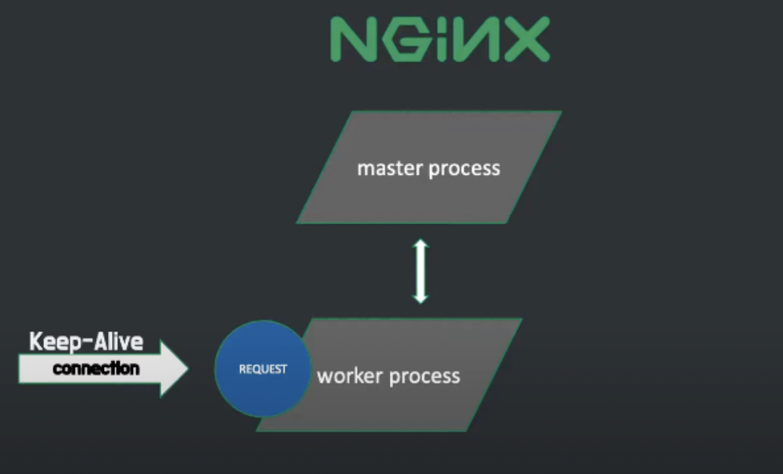
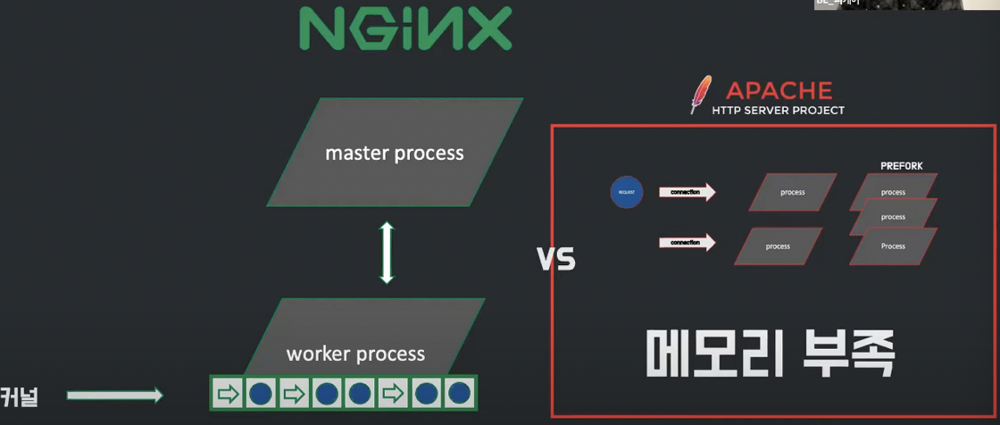
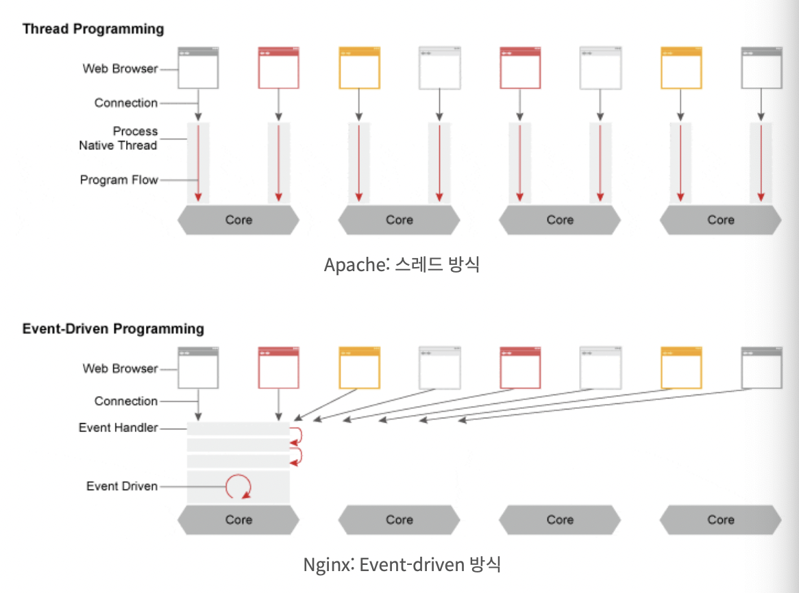
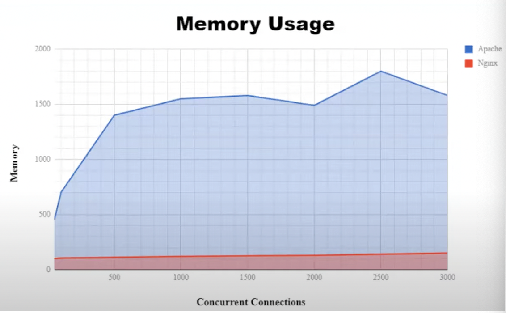
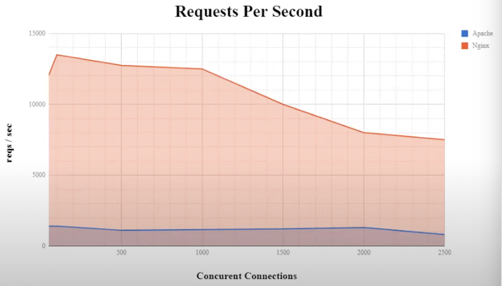

# Nginx

`Tomcat`과 `Nginx` 무엇이 다를까요?

이 글에서는 `Tomcat`의 간단한 정의와 `Nginx`에 대해서 알아볼 것이다.

## Tomcat Server 이란?

아파치 톰캣은 **자바 진영의 오픈소스**이다.

HTTP 요청들을 처리하기 위한 고성능의 오픈소스 HTTP Server이고, 보통 톰캣 서버는 HTTP 요청을 다루는데에 사용된다.

아파치 톰캣이 WAS 아니냐구요? 맞습니다. 하지만 웹 서버도 됩니다. 아파치 톰캣은 웹 서버 뿐만아니라 서블릿 컨테이너도 포함하고 있습니다.

## Nginx 란?

**동시접속 처리에 특**화된 웹서버 프로그램이다. 아파치보다 동작이 단순하고, 전달자 역할만 하기 때문에 동시접속 처리에 특화되어있다.

**동시접속자(약 700명) 이상이라면 서버를 증설하거나 Nginx 환경을 권장**한다고 한다.

`Nginx`는 또한 `비동기 처리 방식(Event-Driven)` 방식을 채택하고 있다.

`Nginx`는 클라이언트의 요청을 받았을 때 요청에 맞는 정적파일을 서빙해주는 HTTP Web Server로 활용되기도 하지만, `Reverse Proxy Server`로 활용하여 WAS의 부하를 줄일 수 있는 로드밸런서 역할을 하기도 한다.

## Nginx가 만들어진 배경

`Apache` 같은 경우 요청이 들어오면 connection을 생성한다.

따라서 새로운 클라이언트 요청이 올 때마다 새로운 process를 생성한다.

하지만 프로세스를 생성하는 과정은 시간이 오래걸리는 작업이기 때문에 프로세스를 미리 만들어 놓는 PREFORK라는 방식을 이용했다.
-> 새로운 클라이언트 요청이 오면 미리 만들어 놓은 프로세스를 할당했다.(만들어놓은 프로세스가 없다면 추가로 생성)

이러한 구조 덕분에 개발자는 다양한 모듈을 만들어서 서버에 빠르게 기능을 추가할 수 있었다. 즉, 확장성이 높았고, Apache Server는 동적 컨텐츠를 처리할 수  있게 되었다.

하지만 이제는 컴퓨터가 많이 보급됨에 따라서 요청이 많아져서 서버에 동시에 연결된 connection이 많을 때 더 이상 새로운 connection을 생성하지 못하게 되었다.

1. **메모리 부족**: connection이 연결될 때마다 프로세스를 생성
2. **무거운 프로그램**: 확장성이 좋다는건 곧 리소스가 많다는 걸 의미한다.
3. **CPU 부하 증가**: 많은 connection 요청이 들어오면 context switching을 많이 하기에 CPU 부하 증가

이러한 문제 때문에 Nginx가 등장하게 되었다.

Nginx는 수많은 동시 connection을 유지하고, 정적 파일에 대한 요청도 처리을 처리할 수 있다.

## Nginx의 구조

그렇다면 Nginx는 어떠한 구조로 되어있길래 그 많은 동시 connection을 유지할 수 있을까?

- `Nginx`는 설정파일을 읽고, 설정에 맞게 `worker process`를 생성하는 `master process`가 있다.
- `worker process`는 **실제로 일을 하는 프로세스**이며 `worker process`가 많들어질때 지정된 listen 소켓을 배정받는다.
- 그리고 그 소켓에 새로운 클라이언트 요청이 들어오면 connection을 형성하고 처리한다.
- connection은 정해진 Keep-Alive 시간만큼 유지된다. 하지만 connection이 형성되었다고 해서 worker process가 해당 **connection 하나만 담당하지는 않는다.**
- 형성된 connection으로부터 아무런 요청이 없다면 새로운 connection을 형성하거나 이미 만들어진 다른 connection으로부터 들어온 요청을 처리한다.

`Nginx`에서는 이러한 connection 형성과 제거, 그리고 새로운 요청을 처리하는 것을 `이벤트(event)`라고 한다.

그리고 이 이벤트들을 `os커널`이 **queue**형식으로 `worker process`에게 전달한다. 이 이벤트들은 queue에 담긴 상태에서 비동기 상태로 대기한다. 그리고 `worker process`는 **하나의 스레드로 이벤트를 꺼내서 처리**해 나간다.

이런 방식은 `worker process`가 쉬지않고 일을 하기에, 요청이 없을 때 프로세스를 방치시키는 `Apache Server`보다 **훨씬 효율적으로 자원을 사용**할 수 있다.

위 이미지를 보면 알 수 있듯이 Apache 방식인 스레드 기반은 하나의 커넥션 당 하나의 스레드를 잡아먹지만 이벤트 기반 방식은 여러 개의 connection을 전부 Event Handler를 통해서 **비동기 방식으로 처리해 먼저 처리되는 것부터 로직이 진행되게끔 한다.**

## Nginx의 장/단점

### 단점

- **동적 컨텐츠를 기본적으로 처리할 수 없다.**
- 동적 컨텐츠에 대한 요청을 처리하려면 **외부 자원과 연계**해야 한다.

### 장점

- **이벤트 중심** 접근 방식을 사용하여 클라이언트 요청을 제공한다.
- 제한된 하드웨어 리소스로도 여러 클라이언트 요청을 **동시에 효율적으로 처리**한다.
- 단일 스레드를 통해서 여러 연결을 처리 가능하다.
- 최소한의 리소스로 웹 서버의 아키텍처를 개선하기 위해서 독립형 HTTP 서버로 배치가 가능하다.

## 성능 비교

위 이미지는 동시 connection 수 당 메모리 사용률을 나타낸다. Apache Server에 비해서 Nginx는 동시 connection 수가 늘어나도 메모리 사용률이 낮고 일정하다.

동시 connection 수가 많아졌을 때 처리하는 초당 요청 수는 Nginx가 Apache에 비해 압도적으로 높은 모습을 보여준다.

## 정리

### Apache의 한계

클라이언트 접속마다 Process 혹은 Thread를 생성하는 구조이다. 1만 클라이언트로부터 동시접속 요청이 들어온다면 CPU와 메모리 사용이 증가하고 추가적인 Process/Thread 생성비용이 드는 등 대용량 요청에서 한계를 보인다. 또한, Apache 서버의 프로세스가 blocking 될 때 요청을 처리하지 못하고 처리가 완료될 때까지 대기상태에 있다. -> 이는 Keep Alive로 해결이 가능하지만 효율이 떨어진다.

### Nginx 정리

`Nginx`는 `Event-Driven` 방식으로 동작한다. 즉, 프로그램 흐름이 이벤트에 의해 결정이 된다. 한 개 또는 고정된 프로세스만 생성하고, 그 내부에서 비동기로 효율적인 방식으로 task를 처리한다. Apache와 달리 동시 접속자 수가 많아져도 추가적인 생성비용이 들지 않는다.

비동기 이벤트 기반으로 요청하여 적은 양의 스레드가 사용되기 때문에 CPU 소모가 적다.

Apache와 달리 CPU와 관계없이 I/O들을 전부 Event Listener로 미루기 때문에 흐름이 끊기지 않는다.

context switching 비용이 적다.