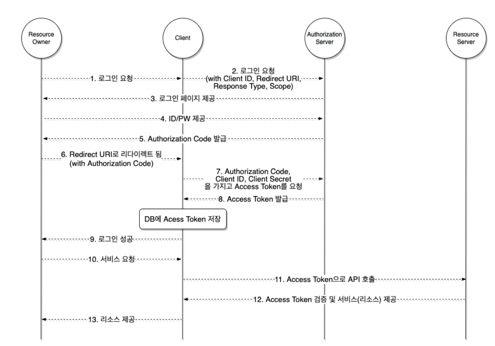
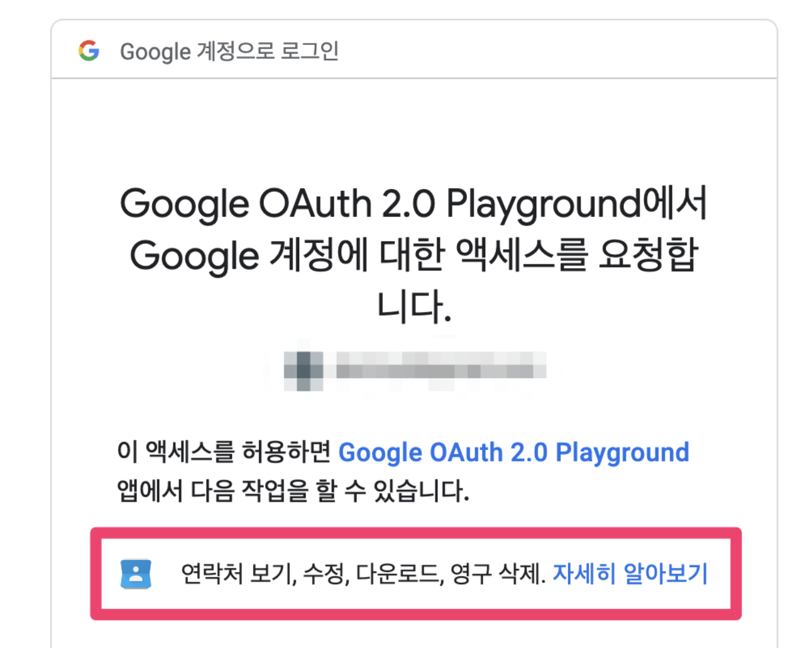

# OAuth 2.0

## OAuth 등장 배경

서비스를 만들다보면 우리가 만든 서비스에 구글 캘린더를 사용한다던지, 페이스북, 트위터에 글을 남기는 기능이 필요할 수 있을 것이다.

이 때, 가장 쉽게 이 기능을 구현하는 방법은 페이스북, 트위터 ID, Password를 직접 제공받아서 우리의 서비스에 저장하고 활용하는 방법이다.

하지만 우리 서비스를 사용자들은 보통 신뢰할까? 처음보는 서비스라면 신뢰하지 않을 것이다.

심지어 일반적으로 사용자들은 많은 웹사이트에서 동일한 ID, Password를 사용하기 때문에 이 정보가 유출된다면 우리 사이트에서 피해가 발생하는 것으로만 끝나지 않을 것이다.

이는 우리 서비스와 구글, 페이스북, 트위터 등의 입장에서도 굉장한 부담이 된다.

이런 문제를 해결하기 위해서 OAuth가 등장하기 이전에는 구글은 AuthSub, 야후는 BBAuth 등 각자 회사가 개발한 방법을 사용하였다. 하지만 이 방식은 표준화 되어있지 않기 때문에 각자의 사이트와 연동하려면 각각의 서비스를 사용해야만 가능했다.

이를 위해 등장한 것이 바로 OAuth이다. 기존에 OAuth 1.0은 모바일 애플리케이션 등에서 안전하게 사용될 수 없는 사례가 등장하면서 사라지게 되었다.

## OAuth 란?

구글, 페이스북, 트위터와 같은 다양한 플랫폼의 특정 사용자 데이터에 접근하기 위해서 제 3자 클라이언트(우리의 서비스)가 사용자의 접근 권한을 위임(Delegated Authorization) 받을 수 있는 표준 프로토콜이다.

즉, 우리의 서비스가 우리 서비스를 이용하는 유저의 타사 플랫폼 정보에 접근하기 위해서 권한을 타사 플랫폼으로부터 위임받는 것이다.

## OAuth 2.0 주체

위에서 언급한 '사용자', '우리의 서비스', '타사 플랫폼(구글, 페이스북, 트위터)'등을 부르는 용어가 존재한다. 이는 다음과 같이 부른다.

### Resource Owner

리소스 소유자. 우리의 서비스를 이용하면서 구글, 페이스북 등의 플랫폼에서 리소스를 소유하고 있는 사용자이다. 리소스라 하면 '구글 캘린더 정보', '페이스북 친구 목록', '네이버 블로그 포스트 작성' 등이 해당될 것이다.

### Authorization & Resource Server

Authorization Server는 Resource Owner를 인증하고 Client에게 액세스 토큰을 발급해주는 서버이다. Resource Server는 구글, 페이스북, 트위터와 같이 리소스를 가지고 있는 서버를 말한다.

### Client

Resource Server의 자원을 이용하고자 하는 서비스. 보통 우리가 개발하려는 서비스가 될 것이다.

## 애플리케이션 등록

OAuth 2.0 서비스를 이용하기전에 선행되어야 하는 작업이 있다. Client를 Resource Server에 등록해야 하는 작업이다. 이 때, Redirect URI를 등록해야 한다. Redirect URI는 사용자가 OAuth 2.0 서비스에서 인증을 마치고(예를들어 구글 로그인 페이지에서 로그인을 마쳤을 때) 사용자를 리디렉션시킬 위치이다.

### Redirect URI

OAuth 2.0 서비스는 인증이 성공한 사용자를 사전에 등록된 Redirect URI로만 리디렉션 시킨다. 승인되지 않은 URI로 리디렉션 될 경우, 추후 설명한 AUthorization Code를 중간에 탈취당할 위험성이 있기 떄문이다. 일부 OAuth 2.0 서비스는 여러 Redirect URI를 등록할 수 있다.

Redirect URI는 기본적으로 보안을 위해 https만 허용된다. 단, 루프백(localhost)은 예외적으로 http가 허용된다.

### Client ID, Client Secret

등록과정을 마치면, Client ID와 Client Secret를 얻을 수 있다. 발급된 Client ID와 Client Secret은 액세스 토큰을 획득하는데 사용된다. 이 때, Client ID는 공개되어도 상관없지만, Client Secret은 절대 유출되어서는 안된다.

## OAuth 2.0의 동작 메커니즘



### 1~2. 로그인 요청

Resource Owner가 우리 서비스의 '구글로 로그인'등의 버튼을 클릭해 로그인을 요청한다. Client는 OAuth 프로세스를 시작하기 위해 사용자의 브라우저를 Authorization Server로 보내야한다.

클라이언트는 이 때 Authorization Server가 제공하는 Authorization URL에 response_type, client_id, redirect_url, scope 등의 매개변수를 쿼리 스트링으로 포함하여 보낸다.

예를 들어 어떤 OAuth 2.0 서비스의 Authorization URL이 https://authorization-server.com/auth라면, 결과적으로 Client는 아래와 같은 URL을 빌드할 것이다.

```text
https://authorization-server.com/auth?response_type=code
&client_id=29352735982374239857
&redirect_uri=https://example-app.com/callback
&scope=create+delete
```

이 때, Authorization Server에게 보낼 매개변수는 아래와 같은 것들이 있다.

- response_type: 반드시 code로 값을 설정해야 한다. 인증이 성공할 경우 클라이언트는 Authorization Code를 받을 수 있다.
- client_id: 애플리케이션을 생성했을 때 발급받은 Client ID
- redirect_uri: 애플리케이션을 생성할 때 등록한 Redirect URI
- scope: 클라이언트가 부여받은 리소스 접근 권한. 아래에서 자세히 설명

### 3~4. 로그인 페이지 제공, ID/PW 제공

클라이언트가 빌드한 Authorization URL로 이동된 Resource Owner는 제공된 로그인 페이지에서 ID와 PW 등을 입력하여 인증할 것이다.

### 5~6. Authorization Code 발급, Redirect URI로 리다이렉트

인증이 성공되었다면, Authorization Server는 제공된 Redirect URI로 사용자를 리디렉션시킬 것이다. 이 때, Redirect URI에 Authorization Code를 포함하여 사용자를 리다이렉션 시킨다. 구글의 경우 코드를 쿼리 스트링에 포함한다.

이 때, Authorization Code란 Client가 Access Token을 획득하기 위해 사용하는 임시 코드이다. 이 코드는 수명이 매우 짧다.

### 7~8. Authorization Code와 Access Token 교환

Client는 Authorization Server에 Authorization Code를 전달하고, Access Token을 응답받는다. Client는 발급받은 Resource Owner의 Access Token을 저장하고, 이후 Resource Server에서 Resource Owner의 리소스에 접근하기 위해 Access Token을 사용한다.

Access Token은 유출되어서는 안된다. 따라서 제 3자가 가로채지 못하도록 HTTPS 연결을 통해서만 사용될 수 있다.

Authorization Code와 Access Token 교환은 token 엔드포인트에서 이루어진다. 아래는 token 엔드포인트에서 Access Token을 발급받기 위한 HTTP 요청의 예시이다. 이 요청은 application/x-www-form-urlencoded 형식에 맞춰 전달해야 한다.

```text
POST /oauth/token HTTP/1.1
Host: authorization-server.com

grant_type=authorization_code
&code=xxxxxxxxxxx
&redirect_uri=https://example-app.com/redirect
&client_id=xxxxxxxxxx
&client_secret=xxxxxxxxxx
```

필수로 전달해야하는 매개변수를 살펴보자.

- grant_type: 항상 authorization_code로 설정되어야 한다.
- code: 발급받은 Authorization Code
- redirect_uri: Redirect URI
- client_id: Client ID
- client_secret: RFC 표준상 필수는 아니지만, Client Secret이 발급된 경우 포함하여 요청해야한다.

### 9. 로그인 성공

위 과정을 성공적으로 마치면 Client는 Resource Owner에게 로그인이 성공하였음을 알린다.

### 10~13. Access Token으로 리소스 접근

이후 Resource Owner가 Resource Server의 리소스가 필요한 기능을 Client에 요청한다. Client는 위 관정에서 발급받고 저장해둔 Resource Owner의 Access Token을 사용하여 제한된 리소스에 접근하고, Resource Owner에게 자사의 서비스를 제공한다.

## OAuth 2.0의 스코프

OAuth 2.0은 스코프라는 개념을 통해서 유저 리소스에 대한 클라이언트의 접근 범위를 제한할 수 있다. 스코프는 여러개가 될 수 있으며, 대소문자를 구분하는 문자열을 공백으로 구분하여 표현된다.

예를 들어 우리의 서비스가 사용자의 구글 연락처를 받아오고 싶다면, OAuth 2.0 스코프에 연락처 스코프 문자열을 포함하여 OAuth 2.0 제공자에게 전달하면 된다. 그렇다면 사용자는 아래의 사진과 같이 스코프에 명시된 권한을 요청하는 화면을 만날 수 있을 것이다.



이 과정을 거쳐 발급된 액세스 토큰은 부여된 스코프에 해당하는 권한을 제한적으로 획득할 수 있다.

## Authorization Code는 그럼 왜 필요한가?

그런데 뭔가 불필요한 과정이 있어보인다. Authorization Code를 발급하지 않고, 곧바로 Client에게 Access Token을 발급해줘도 되지 않을까? 왜 굳이 Access Token을 획득하는 과정에 Authorization Code 발급 과정이 필요할까?

Redirect URI를 통해 Authorization Code를 발급하는 과정이 생략된다면, Authorization Server가 Access Token을 Client에 전달하기 위해 Redirect URI를 통해야 한다. 이 때, Redirect URI를 통해 데이터를 전달할 방법은 URL 자체에 데이터를 실어 전달하는 방법밖에 존재하지 않는다. 브라우저를 통해 데이터가 곧바로 노출되는 것이다.

하지만, Access Token은 민감한 데이터이다. 이렇게 쉽게 노출되어서는 안된다. 이런 보안 사고를 방지하지 위해서 Authorization Code를 사용하는 것이다.

Redirect URI를 프론트엔드 주소로 설정하여 Authorization Code를 프론트엔드로 전달한다. 그리고 이 Authorization Code는 프론트엔드에서 백엔드로 전달된다. 코트를 전달받은 백엔드는 비로소 Authorization Server의 token 엔드포인트로 요청하여 Access Token을 발급한다.

이런 과정을 거치면 Access Token이 항상 우리의 앱과 OAuth 서비스의 백채널을 통해서만 전송되기 때문에 공격자가 Access Token을 가로챌 수 없게된다.

## 백엔드와 프론트엔드의 역할

### 인증 URL 생성

일단, Authorization Server의 로그인 페이지로 이동하기 위한 인증 URL을 생성하는 것은 프론트엔드, 백엔드 어디서해도 괜찮다고 생각한다. 단, Client ID나 Scope와 같은 정보들의 응집도를 위해 이것도 백엔드에서 생성하고, 프론트엔드는 백엔드로부터 URL을 가져오는것이 좋다고 생각한다. 일단, 백엔드에서 URL을 생성한다고 가정.

### Authorization Code와 Access Token 흐름

프론트엔드는 백엔드가 생성한 인증 URL을 가져오고, 프론트엔드는 사용자를 인증 URL로 리다이렉션 시킨다. 그리고 사용자는 로그인을 마치고 Redirect URL로 리다이렉션 될텐데, 이 떄 Redirect URI는 프론트엔드로 설정한다.

프론트엔드로 리다이렉트 되었다면 함께 전달된 Authorization Code를 백엔드 API를 통해서 백엔드로 전달한다. Authorization Code를 전달받은 백엔드는 Authorization Code, Client ID, Client Secret으로 Authorization Server로부터 Access Token을 발급받는다.

### 만약, Redirect URI가 백엔드라면?

Redirect URI를 백엔드 URI로 설정하면, 사용자는 소셜 로그인 이후 백엔드 서버로 리다이렉션될 것이다.

그런데 백엔든느 즉, API 서버는 사용자가 브라우저로 직접 접속하기 위해 존재하는 것이 아니다. 사용자를 백엔드 URI로 리다이렉션 하는 것은 애초에 백엔드 역할을 생각하지 않은 설계라고 생각한다. 그리고 결국 백엔드에서 사용자를 다시 프론트엔드 URI로 리다이렉션 시켜야한다.