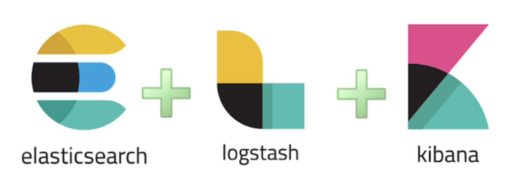

# Elasticsearch

## Elasticsearch란?

- Elasticsearch는 Apache Lucene(아파치 루씬) 기반의 java 오픈소스 분산 검색 엔진이다.
- '데이터 저장소'가 아니라 MySQL 같은 데이터베이스를 대체할 수 없다.
- 방대한 양의 데이터를 신속하고 거의 실시간으로 저장, 검색, 분석할 수 있다.
- Elasticsearch는 검색을 위해 단독으로 사용되기도 하며, ELK(Elasticsearch, Logstash, Kibana) 스택으로 사용되기도 한다.

## ELK(Elasticsearch, Logstash, Kibana) 스택

`ELK`는 아래 그림과 같이 분석 및 저장 기능을 담당하는 `Elasticsearch`, 수집 기능을 하는 `Logstash`, 이를 시각화하는 도구인 `Kibana`의 앞글자만 딴 단어이다.

ELK는 접근성과 용이성이 좋아 최근 가장 핫한 Log 및 데이터 분석 도구이다.

- Logstash
  - 다양한 소스(DB, csv파일 등)의 로그 또는 트랜잭션 데이터를 수집, 징계, 파싱하여 Elasticsearch로 전달
- Elasticsearch
  - Logstash로 부터 받은 데이터를 검색 및 집계를 하여 필요한 관심있는 정보를 획득
- Kibana
  - Elasticsearch의 빠른 검색을 통해 데이터를 시각화 및 모니터링

## Elasticsearch와 RDBMS의 비교

|RDBMS|Elasticsearch|
|:---:|:---:|
|schema|mapping|
|database|index|
|table|type|
|row|document|
|column|field|

## Elasticsearch를 REST API와의 비교

|Elasticsearch|RDBMS|CRUD|
|:---:|:---:|:---:|
|GET|SELECT|READ|
|PUT|UPDATE|UPDATE|
|POST|INSERT|CREATE|
|DELETE|DELETE|DELETE|

## Elasticsearch 핵심 개념

### 클러스터

클러스터는 하나 이상의 노드(서버)가 모인 것이며, 이를 통해 전체 데이터를 저장하고 모든 노드를 보관하는 통합 색인화 및 검색 기능을 제공한다. 클러스터는 고유한 이름으로 식별되는데, 기본 이름은 'elasticsearch'이다.

어떤 노드가 어느 클러스터에 포함되기 위해서는 이름에 의해 클러스터의 구성원이 되도록 설정되기 때문에 이 이름은 매우 중요하다.

노드가 잘못된 클러스터에 포함될 위험이 있으므로 동일한 클러스터 이름을 서로 다른 환경에서 재사용하면 안된다. 예를들어 개발, 스테이지, 프로덕션 클러스터에 logging-dev, logging-stage, logging-prod라는 이름을 사용해야 한다.

클러스터에 하나의 노드만 있는 것은 유효하며 또한 각자 고유한 클러스터 이름을 가진 독립적인 클러스터를 여러 개 둘 수도 있다.

### 노드

노드는 클러스터에 포함된 단일 서버로서 데이터를 저장하고 클러스터의 색인화 및 검색 기능에 참여한다.

노드는 클러스터처럼 이름으로 식별되는데, 기본 이름은 시작 시 노드에 지정되는 임의 UUID이다. 기본 이름 대신에 특정 이름으로 정의가 가능하다.

네트워크의 어떤 서버가 Elasticsearch 클러스터의 어떤 노드에 해당하는지 식별해야 하기 때문에 노드의 이름은 관리 목적에서 중요하다.

노드는 클러스터 이름을 통해서 어떤 클러스터의 일부로 구성될 수 있다. 기본적으로 각 노드는 'elasticsearch'라는 이름의 클러스터에 포함되도록 설정된다. 즉 네트워크에서 다수의 노드를 시작할 경우(각각을 검색할 수 있다고 가정) 이 노드가 모두 자동으로 'elasticsearch'라는 단일 클러스터를 형성하고 이 클러스터의 일부가 된다.

하나의 클러스터에서 원하는 개수의 노드를 포함할 수 있다. 뿐만 아니라 현재 다른 어떤 Elasticsearch 노드도 네트워크에서 실행되고 있지 않은 상태에서 단일 노드를 시작하면 기본적으로 'elasticsearch'라는 이름의 새로운 단일 노드 클러스터가 생긴다.

하나의 클러스터에서 원하는 개수의 노드를 포함할 수 있다. 뿐만 아니라 현재 다른 어떤 Elasticsearach 노드도 네트워크에서 실행되고 있지 않은 상태에서 단일 노드를 시작하면 기본적으로 'elasticsearch'라는 이름의 새로운 단일 노드 클러스터가 생긴다.

### 인덱스

색인은 다소 비슷한 특성을 가진 문서의 모음이다. 이를테면 고객 데이터에 대한 색인, 제품 카탈로그에 대한 색인, 주문 데이터에 대한 색인을 각각 둘 수 있다. 색인은 이름(모두 소문자)으로 식별되며, 이 이름은 색인에 포함된 문서에 대한 색인화, 검색, 업데이터, 삭제 작업에서 해당 색인을 가르키는데 쓰인다.

> 단일 클러스터에서 원하는 개수의 색인을 정의 할 수 있다.

### 타입

하나의 색인에서 하나 이상의 유형을 정의할 수 있다. 유형이란 색인을 논리적으로 분류, 구분한 것이며 그 의미 체계는 전적으로 사용자가 결정한다.

일반적으로 여러 공통된 필드를 갖는 문서에 대해 유형이 정의된다. 예를 들어 블로그 플랫폼을 운영하고 있는데 모든 데이터를 하나의 색인에 저장한다고 가정하면, 이 색인에서 사용자 데이터, 블로그 데이터, 댓글 데이터에 대한 유형을 각각 정의할 수 있다.

### 도큐먼트

도큐먼트는 색인화할 수 있는 기본 정보 단위이다. 예를 들어 어떤 단일 고객, 단일 제품, 단일 주문에 대한 도큐먼트가 각각 존재할 수 있다. 이 문서는 JSON형식이다.

### 샤드 & 리플리카

색인은 방대한 양의 데이터를 저장할 수 있는데, 이 데이터가 단일 노드의 하드웨어 한도를 초과할 수 있다. 예를 들어 10억 개의 문서로 구성된 하나의 색인에 1TB의 디스크 공간이 필요할 경우, 단일 노드의 디스크에서 수용하지 못하거나 단일 노드에서 검색 요청 처리 시 속도가 너무 느려질 수 있다.

### Elasticsearch를 사용하는 이유

- 속도
  - Elasticsearch는 Lucene을 기반으로 구축되기 때문에 전체 텍스트 검색에 뛰어나다. 또한 거의 실시간 검색 플랫폼이기 떄문이다. 이것은 문서가 색인될 때부터 검색 가능해질 때까지 대기 시간이 아주 짧다는 뜻이다. 이 대기 시간은 보통 1초이다. 결과적으로 Elasticsearch는 보안 분석, 인프라 모니터링 같은 시간이 중요한 사용 사례에 이상적이다.
- 분산적
  - Elasticsearch에 저장된 문서는 샤드라고 하는 여러 다른 컨테이너에 걸쳐 분산되며, 이 샤드는 복제되어 하드웨어 장애 시 중복되는 데이터 사본을 제공한다. Elasticsearch의 분산적인 특징은 수백 개의 서버까지 확장하고 페타바이트의 데이터를 처리할 수 있게 해준다.
- 광범위한 기능 세트 제공
  - 속도, 확장성, 복원력 뿐만 아니라, Elasticsearch에는 데이터 롤업, 인덱스 수명 주기 관리 등과 같이 데이터를 훨씬 더 효율적으로 저장하고 검색할 수 있게 해주는 강력한 기본 기능이 다수 탑재되어 있다.
- 데이터 수집, 시각화, 보고를 간소화한다.
  - Beats와 Logstash의 통합은 Elasticsearch로 색인하기 전에 데이터를 훨씬 더 쉽게 처리할 수 있게 해준다. Kibana는 Elasticsearch 데이터의 실시간 시각화를 제공하며, UI를 통해 애플리케이션 성능 모니터링(APM), 로그, 인프라 메트릭 데이터에 신속하게 접근할 수 있다.

