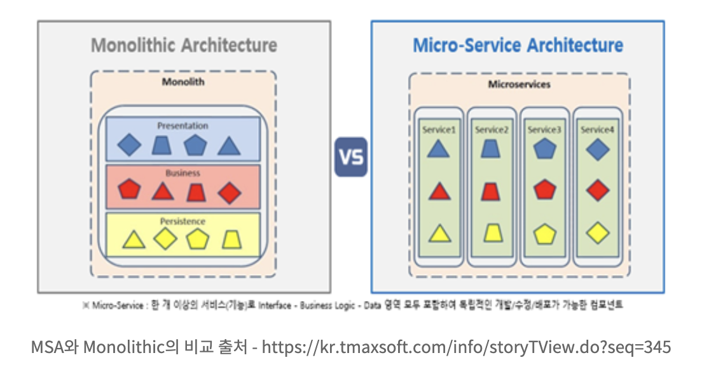

# MSA(MicroService Architecture)

마이크서비스 아키텍처에 대한 정확한 정의는 없다. 하만 `마이크로서비스`란 **작고, 독립적으로 배포 가능한 각각의 기능을 수행하는 서비스로 구성된 프레임워크**라고 할 수 있다.

마이크로서비스는 **완전히 독립적으로 배포가 가능**하고, **다른 기술 스택(개발 언어, 데이터베이스 등)이 사용 가능**한 단일 사업 영역에 초점을 둔다.

## MSA의 등장배경

Monolithic Architecture는 소프트웨어의 모든 구성요소가 한 프로젝트에 통합되어 있는 형태이다. 웹 개발을 예로 들면 웹 프로그램을 개발하기 위해 모듈별로 개발을 하고, 개발이 완료된 웹 애플리케이션을 하나의 결과물로 패키징하여 배포되는 형태를 말한다.

이런 애플리케이션을 모놀리식 어플리케이션이라 하며, 웹의 경우 WAR 파일로 빌드되어 WAS에 배포하는 형태를 말한다. 주로 소규모 프로젝트에 사용된다.

하지만 일정 규모 이상의 서비스, 혹은 수백명 이상의 개발자가 투입되는 프로젝트에서 Monolithic Architecture는 한계를 보인다.

- **부분 장애가 전체 서비스의 장애로 확대될 수 있다.**
  - 개발자의 잘못된 코드 배포 또는 갑작스런 트래픽 증가로 인해 성능에 문제가 생겼을 때, 서비스 전체의 장애로 확대될 수 있다.
- **부분적인 Scale-out이 어렵다.**
  - Monolithic Architecture에서는 사용되지 않는 다른 모든 서비스가 Scale-out 되어야 하기 때문에 부분 Scale-out이 어렵다.
- **서비스의 변경이 어렵고, 수정 시 장애의 영향도 파악이 힘들다.**
  - 여러 컴포넌트가 하나의 서비스에 강하게 결합되어 있기 때문에 수정에 대한 영향도 파악이 힘들다.
- **배포 시간이 오래 걸린다.**
  - 최근 어플리케이션 개발 방법은 CI/CD를 통한 개발부터 배포까지 빠르게 반영하는 추세이다. 그러나 규모가 커짐에 따라 작은 변경에도 높은 수준의 테스트 비용이 발생하기도 하며, 많은 사람이 하나의 시스템을 개발하여 배포하기 때문에 영향을 줄 수 밖에 없다.
- **한 Framework와 언어에 종속적이다.**
  - Spring Framework를 사용할 경우, blockchain 연동 모듈을 추가할 때 node.js를 사용하는 것이 일반적이며 강세이다. 그러나 java를 이용하여 해당 모듈을 작성할 수 밖에 없다. 선정했던 framework가 Spring이기 떄문이다.

이러한 Monolithic Architecture의 문제점들을 보완하기 위해 MSA가 등장하게 되었다. 기존의 특정한 물리적인 서버에 서비스를 올리던 on-promise 서버 기반의 Monolithic Architecture에서 이제는 클라우드 환경을 이용하여 서버를 구성하는 MicroService Architecture로 많은 서비스들이 전환되고 있다.

## MSA의 특징

MSA는 **API를 통해서만 상호작용할 수 있다.** 즉, 마이크로 서비스는 서비스의 end-point을 API 형태로 외부에 노출하고, 실질적인 세부 사항은 모두 추상화한다. 내부의 구현 로직, 아키텍처와 프로그래밍 언어, 데이터베이스, 품질 유지 체계와 같은 기술적인 사항들은 서비스 API에 의해 철저하게 가려진다.

따라서 SOA(Service Oriented Architecture)의 특징을 다수 공통으로 가진다.

> 제대로 설계된 마이크로서비스는 하나의 비즈니스 범위에 맞춰 만들어지므로 **하나의 기능만 수행**한다. 즉, 어플리케이션 출시처럼 하나의 목표를 향해 일하지만 자기가 개발하는 서비스만 책임진다. 그리고 여러 어플리케이션에서 재사용할 수 있어야 한다.

> 어플리케이션은 항상 기술 중립적 프로토콜을 사용해 통신하므로 서비스 구현 기술과는 무관하다. 따라서 마이크로서비스 기반의 어플리케이션을 다양한 언어와 기술로 구축할 수 있다는 것을 의미한다.

> 마이크로서비스는 SOA에서 사용되는 집중화된 관리체계를 사용하지 않는다. 마이크로서비스 구현체의 공통적인 특징중 하나는 ESB(Enterprise Service Bus)와 같은 무거운 제품에 의존하지 않는다는 점이다. REST 등 가벼운 통신 아키텍처, 또는 Kafka 등을 이용한 Message Stream을 주로 사용한다.

### MSA의 장점

> 각각의 서비스는 모듈화가 되어있으며 이러한 모듈끼리는 `RPC` 또는` Message-Driven API` 등을 이용하여 **통신**한다. 이러한 MSA는 각각 개별의 서비스 개발을 빠르게 하며, 유지보수도 쉽게할 수 있도록 한다.

> 팀 단위로 적절한 수준에서 **기술 스택을 다르게 가져갈 수 있다.** 회사가 Java의 Spring 기반이라도 MSA를 적용하면 Node.js로 블록체인 개발 모듈을 연동함에 무리가 없다.

> 마이크로 서비스는 **서비스별로 독립적 배포가 가능**하다. 따라서 지속적인 배포 CD도 모놀로식에 비해서 가볍게 할 수 있다.

> 마이크로서비스는 **각각 서비스의 부하에 따라 개별적으로 Scale-out이 가능**하다. 메모리, CPU 적으로 상당부분 이득이 된다.

### MSA의 단점

> MSA는 모놀로식에 비해 상대적으로 많이 복잡하다. 서비스가 모두 분산되어 있기 때문에 개발자는 내부 시스템의 통신을 어떻게 가져가야 할지 정해야 한다. 또한, **통신의 장애와 서버의 부하 등이 있을 경우 어떻게 Transaction을 유지할지 결정하고 구현**해야 한다.

> 모놀로식에서는 단일 트랜잭션을 유지하면 됐지만 MSA에서는 비즈니스에 대한 DB을 가지고 있는 서비스도 각기 다르고, 서비스의 연결을 위해서는 통신이 포함되기 때문에 **트랜잭션을 유지하는게 어렵다.**

> **통합 테스트가 어렵다.** 개발 환경과 실제 운영환경을 동일하게 가져가는 것이 쉽지 않다.

> 실제 운영환경에 대해서 배포하는 것이 쉽지않다. 마이크로서비스의 경우 서비스 1개를 재배포 한다고 하면 **다른 서비스들과의 연계가 정상적으로 이루어지고 있는지도 확인**해야 한다.

