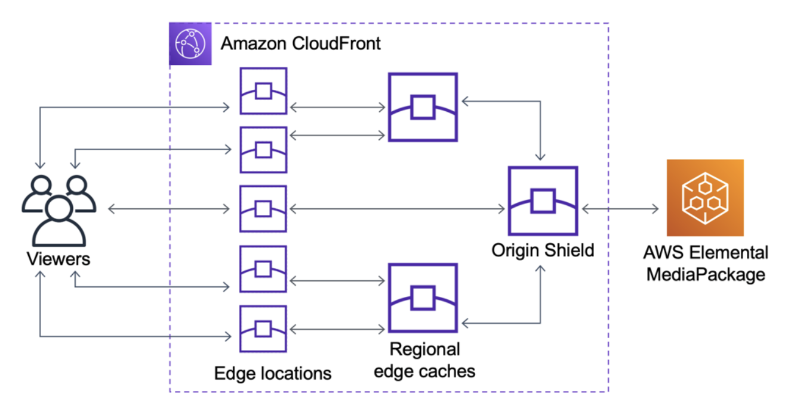

# AWS CloudFront Origin Shield

Origin Shield를 이야기하지 전에 CDN에 대해 이야기하고 넘어가보자.

CDN(Content Delivery Network)는 **지리적으로 분산된 서버들을 연결한 네트워크**로서 웹 컨텐츠의 복사본을 사용자에 가까운 곳에 두거나 동적 컨텐츠의 전달을 활성화하여 **웹 성능 및 속도를 향상**할 수 있도록 하는 네트워크이다.

CDN의 핵심은 두가지이다. 하나는 캐싱을 통한 사용자와 서버간의 거리 단축이고, 다른 하나는 사용자와 캐싱 서버(=엣지 서버)간의 거리를 줄여 불확실한 구간을 최소화하는 것이다. 결론적으로 둘 다 사용자의 지연(Latency)를 최소화 한다는 공통적인 목적을 가지고 있다.

이 때문에 많은 CDN 벤더들은 계층형 캐시를 사용할 수 있는 방법을 제공하고 있다. AWS에서 CloudFront 제품의 기능으로 새롭게 출시한 Origin Shield도 계층형 캐시 기능이라고 볼 수 있다.

CloudFront Origin Shield는 CloudFront `캐싱 인프라의 추가 계층`으로 원본 객체의 부하를 최소화하고 가용성을 높이며 운영 비용을 절감하는 데 도움이 된다.

이 서비스를 사용하면 다음과 같은 이점이 있다.

### 향상된 캐시 적중률

- Origin Shield는 원본 객체 앞에 **캐싱의 추가 계층을 제공**하기 때문에 CloudFront 배포의 **캐시 적중률을 개선**한다.
- 모든 캐싱 계층에서 원본 객체에 대한 모든 요청이 Origin Shield를 통과하기 때문에 캐시 적중률을 높인다.
    
    
    

### 오리진 부하 감소

- Origin Shield는 동일한 객체에 대해서 원본 객체로 전송되는 동시 요청 수를 추가적으로 줄일 수 있다.
- Origin Shield의 **캐시에 없는 콘텐츠에 대한 요청은 동일한 객체에 대한 다른 요청과 통합되어 원본 객체에 대한 요청이 하나만 발생**한다.
    - 즉, **동시 요청 수를 1개로 줄일 수 있어서** 최대 로드, 트래픽 급증 중에 Origin의 가용성을 유지할 수 있고 동적 패키징, 이미지 변환 및 데이터 전송과 같은 비용을 줄일 수 있다.

### 향상된 네트워크 성능

- 오리진에 대한 대기시간이 가장 짧은 AWS 리전에서 Origin Shield를 활성화하면 향상된 네트워크 성능을 얻을 수 있다.
- AWS 리전의 오리진의 경우에 CloudFront 네트워크 트래픽은 오리진에 이르기까지 처리량이 높은 CloudFront 네트워크에 남아 있다.
- AWS 외부에 있는 오리진의 경우 CloudFront 네트워크 트래픽은 오리진에 대한 연결 대기시간이 짧은 Origin Shield에 이르기까지 CloudFront 네트워크에 남아 있다.