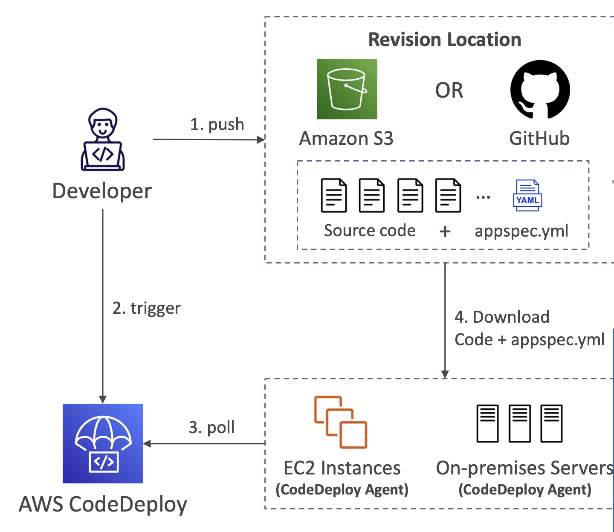
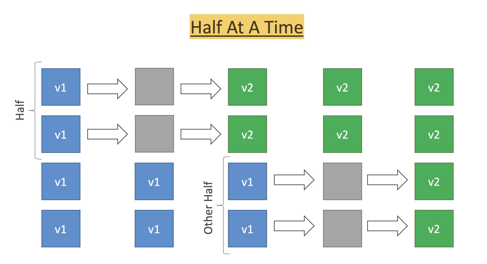
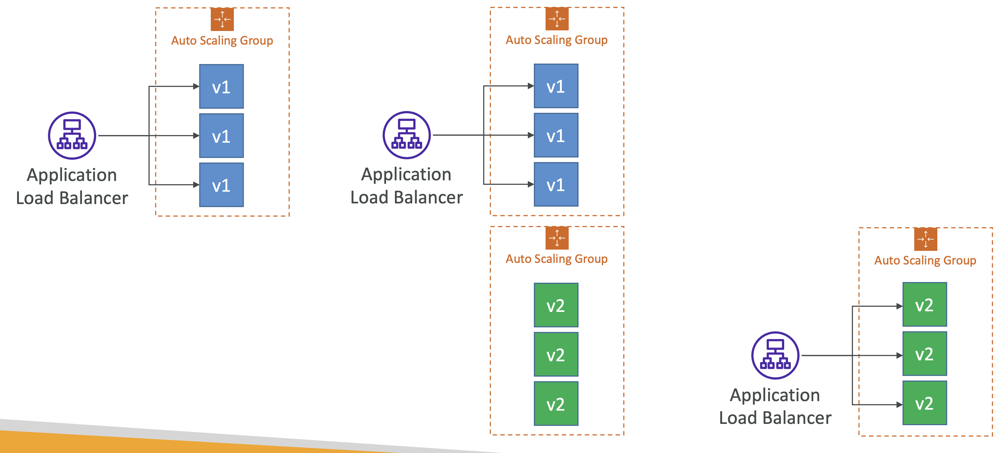

# AWS CodeDeploy

AWS CodeDeploy는 AWS 리소스(EC2, ECS, Lambda 등)들의 자동화 배포를 가능하게 해준다. EC2를 사용한다면 Elastic Beanstalk에 의해 관리되고 있지 않는 EC2 인스턴스만 가능하다.

**조건 및 과정**

AWS CodeDeploy를 사용하려면 몇몇 조건들이 존재한다.

- 배포하려는 각각의 인스턴스들은 CodeDeploy Agent가 실행되어 있어야 한다.
- AWS CodeDeploy 배포 과정을 담은 배포 스크립트 'appspec.yml' 파일은 GitHub 또는 AWS S3로 부터 Pull 되어야 한다.
- Pull 된 배포 스크립트 'appspec.yml' 파일은 인스턴스의 루트 경로에 위치해야 한다.
  - [주의] 루트 경로에 위치하지 않는다면 오류가 발생한다.
- CodeDeploy 관련된 IAM Role을 설정해줘야 한다.

**배포 전략**

배포 전략에는 크게 두 가지가 존재한다.

- In-Place Deployment: 기존의 인스턴스에 덮어씌우는 전략(배포 중 트래픽을 중단하거나 인스턴스가 동작하지 않으므로 운영환경에는 어울리지 않는다. EC2/On-premises 제공)
- Blue/Green Deployment: 기존의 인스턴스에 덮어씌우는 것이 아닌 로드밸런서와 오토 스케일링 그룹을 사용하여 새로운 인스턴스에 배포하면서 트래픽을 이동시키는 전략(무중단 배포를 원하면 선택하는 전략으로 운영환경에 어울리는 전략이다. EC2 인스턴스만 제공하며 Lambda, ECS는 서비스 내에서 선택 가능하다.)

**배포 구성**

배포 구성은 여러가지가 존재하는데, 다음과 같다.

- Configurations
  - One At A Time: 한번에 하나의 인스턴스씩 트래픽을 옮기는 전략
  - Half At A Time: 한번에 인스턴스 개수의 절반씩 트래픽을 옮기는 전략
  - All At A Time: 한번에 모든 인스턴스 트래픽을 옮기는 전략
  - Custom
- Failures
  - 배포에 실패했을 때 어떻게 처리할 지 선택하는 전략으로 Rollback, Redeploy 등 실패했을 때 자동으로 수행할 작업을 정의할 수 있다.
- Deployment Groups
  - 같은 태그에 속하는 EC2 인스턴스들을 그룹화 시켜서 같이 배포하고자 할 때 사용하는 속성이다.
  - 하나의 인스턴스만 배포하더라도 배포 그룹은 필수이다.

## In-Place Deployment

기존 인스턴스에 덮어씌우는 전략으로 예시를 보면 다음과 같다.

위 그림은 한번에 인스턴스 개수의 절반씩 트래픽을 옮기는 전략으로 같은 배포 그룹에 총 4개의 인스턴스를 새롭게 배포하는 그림이다.

첫 두개의 인스턴스를 배포하는 중에 인스턴스가 비어있는 모습을 볼 수 있다. In-Place 전략은 인스턴스를 덮어씌우는 배포 전략으로 중간에 트래픽을 차단하고 배포를 수행해야 한다.(차단하지 않을 수도 있음) 따라서 무중단 배포가 아니므로 운영 환경에는 어울리지 않는 배포 전략이라고 할 수 있다.

첫 두개의 인스턴스를 배포한 다음 나머지 두 개의 인스턴스를 배포하는 것을 볼 수 있다.

## Blue/Green Deployment

이 방식은 무중단 배포를 해야하는 운영 환경에 어울리는 전략이다.

배포를 시작하면 우선 오토스케일링 그룹을 통해서 배포하기 위한 새로운 버전2의 인스턴스를 생성한다. 그런다음 'appspec.yml'파일을 보고 새로운 인스턴스에 애플리케이션을 설치하게 된다. 

설치가 완료되면 로드밸런서의 타깃그룹의 헬스체크를 수행하여 새로운 버전의 애플리케이션 상태가 양호한지 확인한다.

새로운 버전의 애플리케이션의 상태가 양호하면 로드 밸런서를 통해서 트래픽을 트래픽 이동 전략에 따라서 이동시키게 된다.

트래픽이 다 이동이 되었으면 기존 버전1의 트래픽을 차단하고, 기존 애플리케이션 종료 전략에 따라서 기존의 인스턴스를 삭제하게 된다.