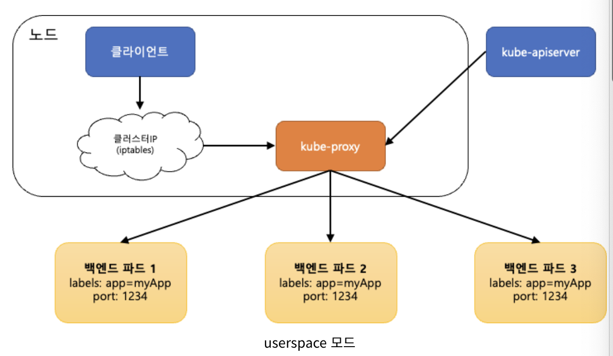
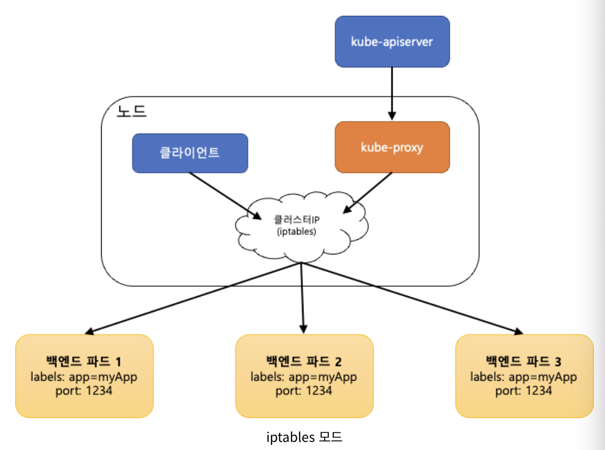
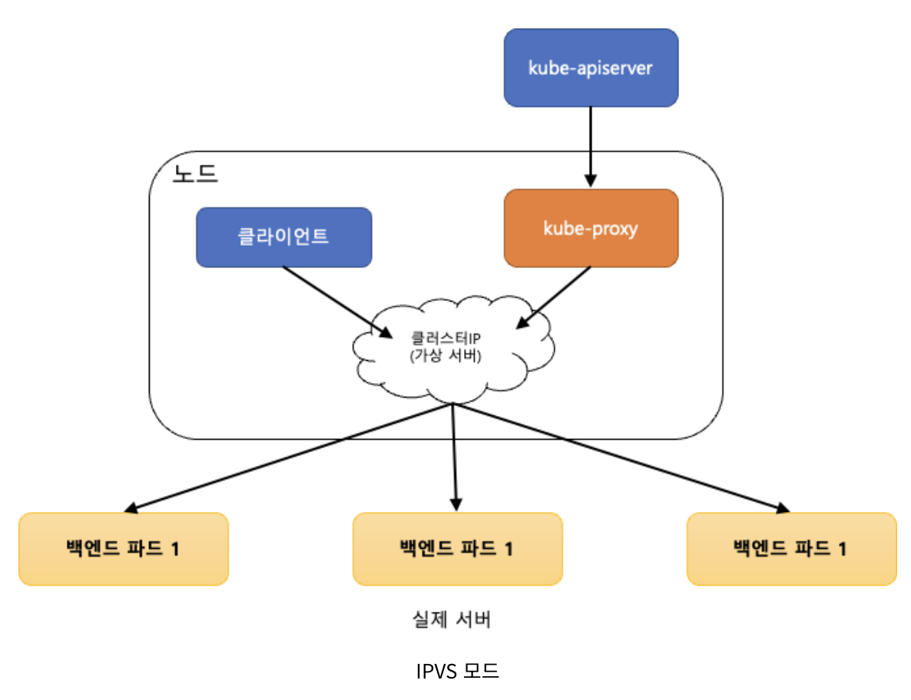

# [k8s] kube-proxy가 네트워크를 관리하는 3가지 모드(userspace, iptables, IPVS)

**kube-proxy**는 쿠버네티스에서 서비스를 만들었을 때 **Cluster IP**나 **NodePort**로 접근할 수 있게 하는 실제 조작을 하는 컴포넌트이다. 쿠버네티스 클러스터의 **노드마다 실행**되면서 **클러스터 내부 IP로 연결하려는 요청을 적절한 Pod으로 전달**한다.

kube-proxy가 네트워크를 관리하는 방법은 userspace, iptables, IPVS가 있다. 초기에는 userspace가 기본 관리 모드였고, 2019년 12월에는 iptables가 기본 관리 모드로 바뀌었다. 앞으로는 iptables에서 IPVS로 기본 관리 모드가 바뀔 것으로 예상된다.

## userspace 모드

클라이언트에서 서비스의 클러스터 IP를 통해 어떤 요청을 하면 **iptables를 거쳐서 kube-proxy가 요청을 받는다.** 그리고 서비스의 **클러스터 IP는 연결되어야 하는 적절한 Pod으로 연결**해준다. 이 때, 요청을 pod들에게 나눠줄 때는 라운드 로빈(round robin) 방식을 사용한다.

## iptables 모드

userspace 모드와 다른 점은 **kube-proxy가 iptables를 관리하는 역할만 한다**는 것이다. 직접 클라이언트에서 트래픽을 받지 않는다.

클라이언트에서 오는 **모든 요청은 iptables를 거쳐서 Pod으로 직접 전달된다.** 그래서 userspace 모드 보다 요청 처리 성능이 좋다.

## IPVS(IP Virtual Server) 모드

**IPVS(IP Virtual Server) 모드는 리눅스 커널에 있는 L4 로드 밸런싱 기술**이다. 리눅스 커널 안 네트워크 관련 **넷필터(Netfilter)** 에 포함되어 있습니다. 따라서 IPVS 커널 모듈이 노드에 설치되어야 한다.

IPVS 모드는 **커널 스페이스**에서 동작하고 데이터 구조를 해시 테이블로 저장하기 때문에 iptables 모드 보다 빠르고 좋은 성능을 낸다. 또한 더 많은 로드밸런싱 알고리즘이 있어서 이를 이용할 수 있다.
