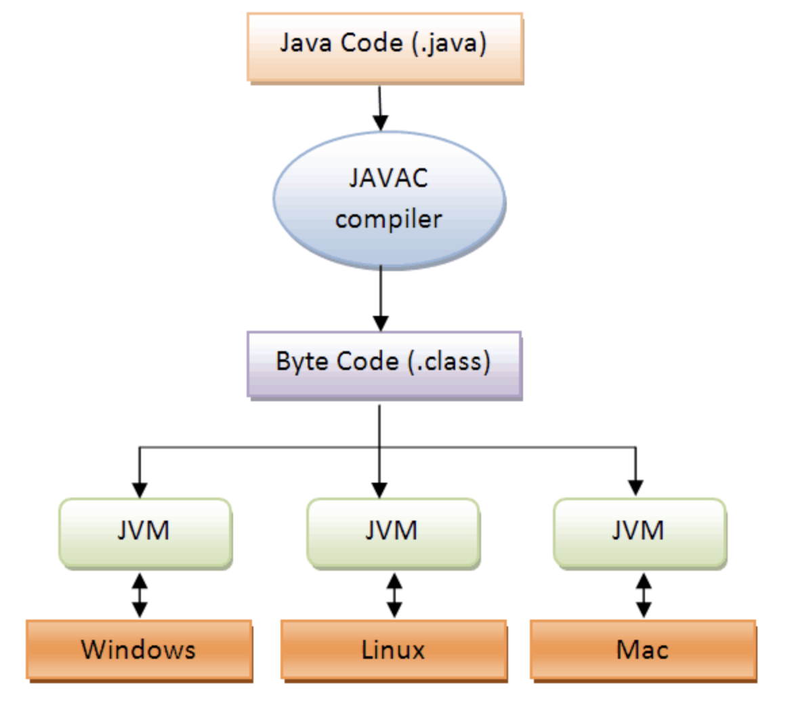
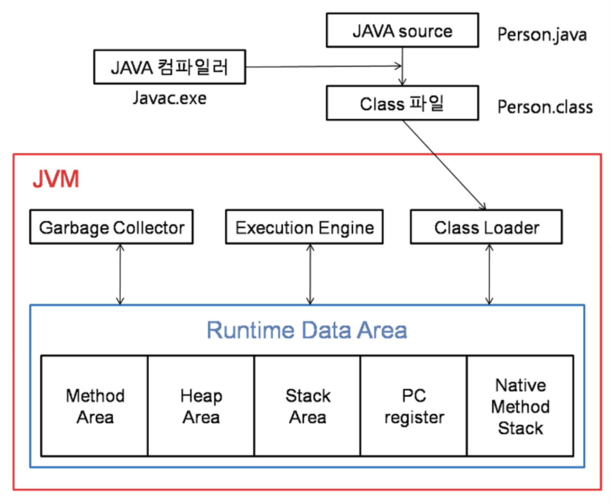

# JVM 이란?

JVM은 Java Virtual Machine의 약자로, 자바 가상머신이라고 부른다. JVM은 자바와 운영체제 사이에서 중개자 역할을 수행하며, 자바가 운영체제에 구애받지 않고 프로그램을 실행할 수 있도록 도와준다.(JVM은 운영체제에 종속적임) 

또한 Garbage Collector를 사용한 **메모리 관리도 자동으로 수행**하며 다른 하드웨어와 다르게 레지스터 기반이 아닌 스택 기반으로 동작한다.

Java 프로그램을 실행하는 동작 원리는 다음과 같다.

우선적으로 src/Test.java 파일을 구동한다고 가정해보면 실행 과정은 다음과 같다.

1. Test.java는 소스파일이어서 그 자체로 실행이 불가능하다. 따라서 Test.java를 실행하면 우선 **컴파일** 과정을 거치게 된다.
2. 컴파일이 성공적으로 완료된 소스파일(Test.java)는 **실행 가능한 파일(Test.class)를 생성**하게 된다. 단, `.class` 파일은 실행파일(.exe)이 아니고 바이트코드(byte code)이기 때문에 **바로 실행이 불가능**하다.
3. 마지막으로 `JVM`이 `.class` 파일을 메모리에 로드하고, 자신의 운영체제에 맞게 다시 컴파일을 하여 `.exe` 를 만들어서 실행한다.

JVM 덕분에 자바를 운영체제에 독립적으로 실행할 수 있지만, JVM은 운영체제에 종속적이다. 따라서 만약 자바 소스파일을 리눅스 환경에서 만들고 이 소스파일을 윈도우에서 실행하고 싶다면 윈도우용 JVM을 설치하여 실행하면 된다.

## JVM 구조

JVM 내부에서는 크게 `Class Loader`, `Garbage Collector`, `Execution Engine` 의 세 가지로 나뉜다.

**Class Loader**

자바 컴파일러가 .java 파일을 컴파일하면 `.class` 파일(바이트 코드)가 생성된다. 이렇게 생성된 클래스 파일을 엮어서 `Runtime Data Area` 형태로 메모리에 적재하는 역할을 한다.

1. 어떤 메서드를 호출하는 문장을 만났는데, 그 메서드를 가진 클래스 바이트코드가 아직 로딩된 적이 없다면 곧바로 JVM은 JRE 라이브러리 폴더에서 클래스를 찾는다.
2. 없으면 ClassPath 환경변수에 지정된 폴더에서 클래스를 찾는다.
3. 찾았으면 그 클래스 파일이 올바른지 바이트코드를 검증한다.
4. 올바른 바이트코드라면 메서드 영역으로 파일을 로딩한다.
5. 클래스 변수를 만들라는 명령어가 있으면 메서드 영역에 그 변수를 준비한다.
6. 클래스 블록이 있으면 순서대로 그 블록을 실행한다.

이렇게 한번 클래스의 바이트코드가 로딩되면 **JVM이 종료될 때까지 유지**한다.

**Execution Engine**

메모리에 적재된 클래스들을 **기계어로 변경해서 명령어 단위로 실행**하는 역할을 한다.

방식에는 두 가지가 있는데, 명령어를 하나씩 실행하는 `인터프리터` 방식과 **실행 시점에 자주 쓸만한 코드들을 기계어로 변환 시켜놓고 저장해서 사용**하는 `JIT(Just In Time)` 방식이 있다.

**Garbage Collector**

Heap 메모리 영역에 생성된 객체들중에 Reachability를 잃은 객체를 탐색 후 제거하는 역할을 한다.

자세한 내용은 검색해서 살펴보도록 하자.

**Runtime Data Area**

- Method Area
  - 클래스 멤버변수, 메서드 정보, Type(Class, Interface) 정보, Constant Pool, static, final 변수 등이 생성된다.
- Heap Area
  - 동적으로 생성된 오브젝트와 배열이 저장되는 곳으로 Garbage Collection의 대상이 되는 영역이다.
- Stack Area
  - 지역 변수, 파라미터 등이 생성되는 영역이다. 동적으로 객체를 생성하면 실제 객체는 Heap 영역에 할당되고 **해당 참조만 Stack에 저장**된다. Stack은 스레드별로 독자적으로 가진다.
  - Heap에 있는 오브젝트가 **Stack에서 참조할 수 없는 경우에는 GC의 대상**이 된다.
- PC Register
  - 현재 쓰레드가 **실행되는 부분의 주소와 명령을 저장**하고 있다. (CPU의 PC Register와는 다르다.)
- Native Method Stack
  - 자바외 언어로 작성된 네이티브 코드를 위한 메모리 영역이다.