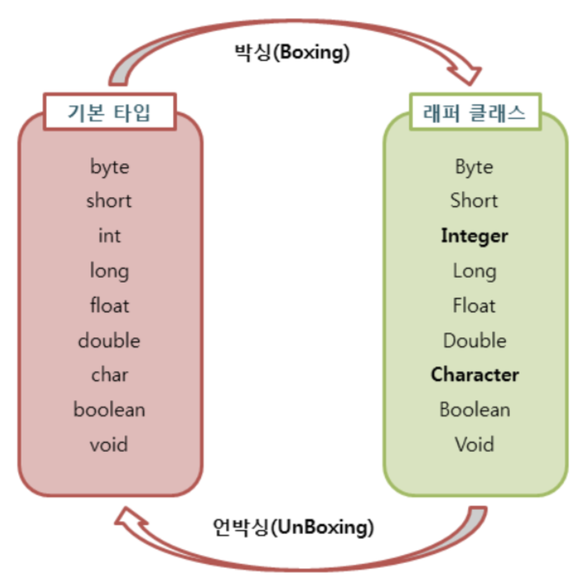

# Wrapper Class(래퍼 클래스)

자바를 사용하다 보면 **기본 타입의 데이터를 객체로 취급해야 하는 경우**가 있다. 예를 들어, 메서드의 인수로 객체 타입만이 요구되면, 기본 타입 데이터를 그대로 사용할 수 없다.

이 때, 기본 타입의 데이터를 먼저 객체로 변환한 후 작업을 수행해야 한다.

## 래퍼 클래스

래퍼 클래스란 `기본 타입`에 해당하는 데이터를 `객체(참조 자료형)`으로 **포장**해주는 클래스이다.

사용 이유 ?
- 기본 자료형의 값을 단순히 값으로만 사용하지 않고 **참조 자료형 처럼 (객체 형태로)** 사용하기 위해서
- 객체 또는 클래스가 제공하는 **메서드 사용**
- 기본 자료형의 값을 **숫자, 문자로의 형변환** 할 경우
- 그 외에도 **null 값을 이용**, **제네릭** 사용 이유로

래퍼 클래스는 각각의 타입에 해당하는 데이터를 인수로 전달받아 해당 값을 가지는 객체로 만들어준다. 이러한 래퍼 클래스는 모두 `java.lang` 패키지에 포함되어 제공된다.

> ex) Integer num1 = new Integer(1);

래퍼 클래스(Wrapper class)는 산술 연산을 위해 정의된 클래스가 아니므로, **인스턴스에 저장된 값을 변경할 수 없다.**

단지, 값을 참조하기 위해서 새로운 인스턴스를 생성하고, 생성된 인스턴스의 값만을 참조할 수 있다.

기본 타입과 래퍼 타입에 대응하는 타입은 다음과 같다.

|기본 타입|래퍼 타입|
|---|---|
|byte|Byte|
|short|Short|
|int|Integer|
|long|Long|
|float|Float|
|double|Double|
|char|Character|
|boolean|Boolean|

모든 래퍼 클래스의 상위 클래스는 Object 이기에 Object의 메서드를 상속받는다.(ex. equals(), toString() 등)

**박싱(Boxing)과 언박싱(UnBoxing)**



- **박싱(Boxing)**: **기본 타입의 데이터를 래퍼 클래스의 인스턴스로 변환**하는 과정
- **언박싱(UnBoxing)**: 래**퍼 클래스의 인스턴스에 저장된 값을 기본 타입의 데이터로 꺼내**는 과정

**오토 박싱(AutoBoxing)과 오토 언박싱(AutoUnBoxing)**

**JDK 1.5**부터는 박싱과 언박싱이 필요한 상황에서 **자바 컴파일러가 이를 자동으로 처리**해준다. 이렇게 자동화된 박싱과 언박싱을 `오토 박싱(AutoBoxing)`과 `오토 언박싱(AutoUnBoxing)`이라고 한다.

**래퍼 클래스에서의 값 비교**

- `==`(동등 연산자) 사용 시: 두 인스턴스의 **주소값**을 비교
- `equals()` 메서드 사용 시: 두 인스턴스에 **저장된 값**을 비교
- 따라서 인스턴스에 저장된 값의 동등 여부를 판단하려면 equals() 메서드를 사용해야 한다.

```java
Integer num1 = new Integer(1);
Integer num2 = new Integer(1);

System.out.println(num1 == num2); // false (주소값이 다르므로)
System.out.println(num1.equals(num2)); // true (저장된 값이 같으므로)
```

단, JAVA에서 자주 사용하는 정수 범위(-128~127)에서 오토 박싱이 될 경우, Cache를 사용한다. 이 범위일 경우 `Integer.valueOf(정수)` 는 새로운 Integer 객체를 생성하지 않고 내부의 IntegerCache 객체로부터의 Integer 객체를 리턴해준다.

예시 1) `Integer a = 127;` 이라는 식의 오토박싱은 내부적으로는 Integer.valueOf(127)을 사용하므로 이 때는 Cache를 사용한다.

예시 2) `Integer num2 = new Integer(127);` 이라는 식의 그냥 객체 생성하는 로직은 Cache를 사용하지 않는다.

```java
Integer A = 127; // 오토 박싱, 내부적으로는 Integer A = Integer.valueOf(127);
Integer B = 127;

System.out.println(a==b);           // True 원래 객체라면 '==' 비교는 주소값이 다르므로 False가 나오겠지만, 
                                    // 이 경우 IntegerCache 에서 같은 객체를 리턴받았기 때문에 주소값도 같음!
System.out.println(a.equals(b));    // True
```