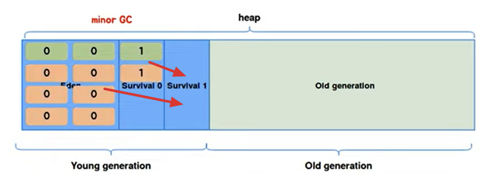

# Garbage Collection

Garbage Collection은 자바의 메모리 관리 방법 중 하나로 JVM의 Heap 영역에서 **동적으로 할당했던 메모리 영역 중 필요없게 된 메모리 영역을 주기적으로 삭제하는 프로세스**를 말한다.

C나 C++에서는 이러한 Garbage Collection이 없어 프로그래머가 수동으로 메모리 할당과 해체를 일일이 해줘야 하는 반면에 Java는 JVM에 탑재되어 있는 Garbage Collector가 메모리 관리를 대행해주기 때문에 개발자 입장에서 메모리 관리, 메모리 누수(Memory Leak) 문제에 대해 완벽하게 관리하지 않아도 되어 오롯이 개발에만 집중할 수 있다는 장점이 있다.

**단점**

가비지 컬렉션에는 장점만 있는 것이 아니라 단점도 존재한다. 대표적으로 다음과 같은 2가지가 존재한다.

1. 개발자가 **메모리가 언제 해제되는지 정확하게 알 수 없다.**
2. `Garbage Collection`이 동작하는 동안에는 **다른 동작을 멈추기 때문에 오버헤드가 발생**한다.
   - **정확하게는 Major GC가 동작할 때 모든 스레드가 동작을 멈춘다.**

이 중에서 경우에 따라서 문제가 발생할 수 있는 부분은 GC가 동작하는 동안에는 JVM의 다른 동작들은 잠깐 멈추기 때문에 오버헤드가 발생한다는 점이다.

이로 인해서 GC가 너무 자주 실행되면 SW 성능 하락의 문제가 되기도 한다. 이러한 특성으로 인해 실시간으로 계속 동작해주어야 하는 시스템들(열추적 미사일의 경우 잠깐의 소프트웨어 일시정지로도 목표한 결과가 달라질 수 있다)로 인해 GC의 사용이 적합하지 않을 수 있다.

## GC의 대상이 되는 객체들

객체들은 실질적으로 Heap 영역에서 생성되고 Method Area나 Stack Area등 Root Area에서는 Heap Area에 생성된 객체의 주소만 참조하는 형식으로 구성된다.

하지만 이렇게 생성된 Heap Area의 객체들이 **메서드가 끝나는 등의 특정 이벤트**들로 인하여 **Heap Area 객체의 메모리 주소를 가지고 있는 참조 변수가 삭제되는 현상**이 발생하면 위의 그림에서 빨간색 객체와 같이 Heap 영역에서 어디서든 참조하고 있지 않은 객체들이 발생하게 된다.

이러한 객체들을 `Unreachable`하다고 하며 주기적으로 GC가 제거해주게 된다.

## Mark And Sweep 알고리즘

Mark And Sweep 알고리즘은 GC가 동작하는 원리로 **루트에서부터 해당 객체에 접근 가능한지에 대한 여부**를 메모리 해제의 기준으로 삼는다.

- **Mark 과정**: 먼저 Root로 부터 그래프 순회를 통해 연결된 객체들을 찾아내어 각각 **어떤 객체를 참조하고 있는지 찾아서 마킹**한다.
- **Sweep 과정**: 참조하고 있지 않은 객체. 즉, **Unreachable 객체들을 Heap에서 제거**한다.
- **Compact 과정**: Sweep 후에 분산된 객체들을 Heap의 시작 주소로 모아 **메모리가 할당된 부분과 그렇지 않은 부분으로 압축**한다.(GC의 종류에 따라 하지않은 경우도 있다)

## GC의 대상이 되는 Heap 영역

Heap Area는 효율적인 GC를 위해서 위와 같이 Young generation(Eden, Survival), Old Generation으로 나뉜다.

- Young Generation
  - **새롭게 생성된 객체가 할당(Allocation)되는 영역**
  - 대부분의 객체가 금방 Unreachable 상태가 되기 때문에, **많은 객체가 Young Generation 영역에 생성되었다가 사라진다.**
  - Eden 영역은 새로 생성된 객체가 할당(Allocation)되는 영역이고, Survival 영역은 최소 1번의 GC 이상 살아남은 객체가 존재하는 영역이다.
  - Young Generation 영역에 대한 GC를 `Minor GC`라고 부른다.
- Old Generation
  - Young Generation 영역에서 **Reachable 상태를 유지**하여 살아남은 객체가 복사되는 영역이다.
  - Young Generation 영역보다 크게 할당되며, 영역의 크기가 큰 만큼 GC는 적게 발생한다.
  - Old Generation 영역에 대한 GC를 `Major GC`라고 부른다.

## GC 동작 과정

**첫 번째 과정**

객체가 처음 생성되고 Heap 영역에 Eden에 age-bit 0으로 할당된다. 이 age-bit는 Minor GC에서 살아남을 때마다 1씩 증가하게 된다.

**두 번째 과정**

시간이 지나 Heap Area에 **Eden 영역에 객체가 다 쌓이게 되면** Minor GC가 한번 일어나게 되고 **참조 정도에 따라 Survival 0 영역으로 이동하거나 회수**된다.

**세 번째 과정**

**계속해서 Eden 영역에는 신규 객체들이 생성**된다. 이렇게 또 Eden 영역에 객체가 다 쌓이게 되면 **Young Generation(Eden+Survival) 영역에 있는 객체들을 비어있는 Survival인 Survival 1 영역에 이동**하고 **살아남은 모든 객체들은 age가 1씩 증가**한다.

**네 번째 과정**

또 다시 Eden 영역에 신규 객체들로 가득 차게되면 다시한번 Minor GC가 일어나고, Young Generation(Eden+Survival) 영역에 있는 객체들을 비어있는 Survival인 Survival 0로 이동시킨 뒤 age를 1 증가시킨다. **이 과정을 계속 반복한다.**

**다섯 번째 과정**

이 과정을 반복하다 보면 age bit가 특정 숫자 이상으로 되는 경우가 발생한다.

이 때 **JVM에서 설정해놓은 age bit에 도달하게 되면** 오랫동안 쓰일 객체라고 판단하고 **Old generation 영역으로 이동**시킨다. 이 과정을 `프로모션(Promotion)`이라고 한다.

**마지막 과정**

시간이 지나 **Old 영역에 할당된 메모리가 허용치를 넘게되면, Old 영역에 있는 모든 객체들을 검사하여 참조되지 않는 객체들을 한꺼번에 삭제**하는 GC가 실행된다.

이렇게 **Old generation 영역의 메모리를 회수하는 GC**를 `Major GC`라고 한다. Major GC는 시간이 오래 걸리는 작업이고, 이 때 **GC를 실행하는 스레드를 제외한 모든 스레드는 작업을 멈추게 된다.** 이를 `'Stop-the-World'`라고 부른다. **이 작업이 너무 잦으면 프로그램 성능에 문제가 될 수 있다.**