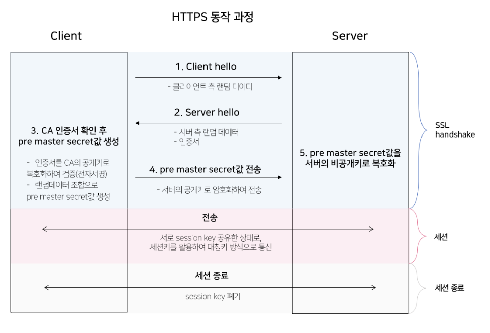

# HTTPS

`HTTP` 프로토콜을 사용하면 서버 - 클라이언트 간 전송되는 정보가 암호화되지 않는다는 단점이 있다. 이는 중간에 누군가 데이터를 쉽게 도난할 수 있다는 점이다.

이에 따라 `HTTPS` 프로토콜이 등장하였는데, `HTTPS` 프로토콜은 `SSL(보안 소켓 계층)`을 사용함으로써 이 문제를 해결했다. `SSL`은 서버와 클라이언트 사이에 안전하게 암호화 된 연결을 만들 수 있도록 도와주고 이 정보들이 도난 당하는 것을 막아준다.

`HTTPS`의 가장 큰 특징은 `SSL 인증서`이다. SSL 인증서는 사용자가 사이트에 제공하는 정보를 암호화하고 있다.

따라서 데이터는 암호화되어 중간에 이 정보를 누군가 훔친다고 하더라도 암호화 되어 있기 때문에 해독할 수 없다.

## SSL 암호화 방식

결론부터 말하면 SSL은 **공개키와 비공개키 암호화 방식을 모두 합친 방식을 이용**한다. 공개키 방식으로 키를 암호화하고, 실제 데이터를 주고 받을 때는 대칭키를 이용해서 데이터를 주고받는다.

### 대칭키(비공개키)

**동일한 키로 암호화와 복호화**를 하는 방식으로 비공개키를 사용한다.

단점은 비공개키를 사용하기 때문에 암호를 주고받는 사람들 사이에 대칭키를 전달할 때 대칭키가 유출되면 외부에서 복호화하여 데이터를 감청할 수 있어서 **보안에 취약하다.**

### 비대칭키(공개키)

**서로 다른 키로 암호화와 복호화**를 하는 방식이다. 이 때, 두 개의 키 중 하나를 비공개키(private key, 개인키, 비밀키)로 하고 나머지를 공개키(public key)로 지정한다. 비공개키는 자신만이 가지고있고, 공개키를 타인에게 제공한다.

장점은 공개키가 유출된다고 해도 비공개키를 모르면 정보를 복호화할 수 없기 때문에 안전하다.

단점은 많은 컴퓨터 자원을 사용한다는 점이 존재한다.

## HTTPS(SSL) 동작 과정

SSL은 데이터를 전송할 때 공개키와 대칭키를 혼합해서 사용한다.

- 실제 주고받을 데이터는 대칭키 방식으로 암호화/복호화
- 이 때의 대칭키(세션키)는 공개키 방식으로 암호화/복호화

### 1. SSL Handshake

클라이언트가 서버에 접속하면 서버는 클라이언트에게 SSL 인증서 정보를 전달하고, 해당 인증서가 확인이 된 이후에 내부에 존재하는 공개키를 활용해서 세션키를 생성하고 이를 활용해서 통신을 시작한다.

이렇게 SSL 프로토콜을 활용해서 통신을 수립하는 과정을 SSL/TLS Handshake 라고 한다.

동작 과정은 다음과 같다.

1. Client Hello: 클라이언트가 서버에 접속한다.
  - 클라이언트 측에서 생성한 랜덤 데이터
  - 세션 아이디: 이미 SSL 핸드 쉐이킹을 했다면 기존의 세션을 재활용하게 되는데, 이 때 **사용할 연결에 대한 식별자를 서버측으로 전송**한다.
2. Server Hello: 서버가 Client Hello에 대해서 응답한다.
   - 서버 측에서 생성한 랜덤 데이터
   - `SSL 인증서`
3. 클라이언트는 해당 **서버가 신뢰할 만한 서버인지 검증**하고 `pre master secret` 값을 생성한다.
   - 서버의 인증서를 확인한다. CA의 공개키로 서버의 인증서를 복호화하고, 복호화에 성공 시 해당 서버는 신뢰할 만한 서버라고 인지(전자서명 방식)
   - 클라이언트는 서버 측 랜덤 데이터와 클라이언트 측 랜덤 데이터를 조합해서 `pre master secret(대칭 키)`라는 키를 생성한다.
4. 클라이언트는 `pre master secret` 값을 서버에 전송한다.
   - 이 때, **공개키 방식을 사용**한다.
   - 서버의 공개키(서버로부터 받은 인증서 안에 있음)로 `pre master secret` 값을 암호화해서 서버로 전송하면 서버는 자신의 비공개키로 안전하게 복호화 할 수 있다.
5. 서버는 클라이언트가 전송한 `pre master secret` 값을 자신의 **비공개키로 복호화**한다.
  - 서버와 클라이언트는 `pre master secret` 값을 공유하고, 이 값을 `master secret` 값으로 만든다.
  - `master secret`는 `session key`를 생성한다.
  - 이후부터는 `session key`값을 **이용해서 서버와 클라이언트는 데이터를 대칭키 방식으로 암호화 한 후에 주고받는다.** -> 세션
5. 클라이언트와 서버는 핸드쉐이크 단계의 종료를 서로에게 알린다.

### 2. 전송

- 세션은 실제로 서버와 클라이언트가 데이터를 주고받는 단계이다.
- `session key`를 이용해서 **대칭키 방식으로 암호화하여 통신**한다.

### 3. 세션 종료

- 데이터의 전송이 끝나면 SSL 통신이 끝났음을 서로에게 알려준다.
- 이 때 **통신에서 사용한 세션키는 폐기**한다.

