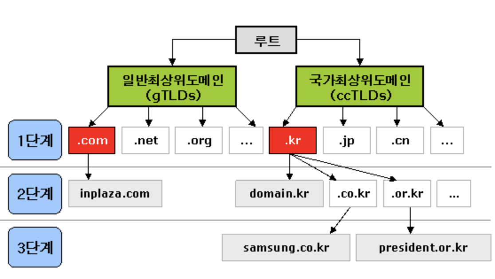

# DNS

`DNS`는 `Domain Name System`의 약자이다. 우선적으로 `DNS`의 `Domain`이 무엇인지 알아보자.

## Domain(도메인)이란?

도메인이란 웹 브라우저를 통해서 특정 사이트에 진입할 때, `IP 주소`를 대신하여 사용하는 주소이다.

왜 사용할까? IP주소는 사람이 외우기가 어렵고 요즘 IPv4 주소는 거의 다 사용하고 고갈되었기 때문에 자주 변경될 수 있기 때문이다.

따라서 도메인을 이용하면 한눈에 파악하기 힘든 IP주소를 보다 분명하게 나타낼 수 있다.

예를들어 111.111.22.33 과 같이 IP 형식의 주소를 www.dns-test.com 과 같은 형식으로 바꾸어 주고 또한 이 반대의 역할도 수행한다.

**DNS 라는 시스템을 이용해서 IP 주소와 도메인을 매핑**해준다.

## DNS(Domain Name System)이란?

DNS란 **웹 사이트의 IP주소와 도메인 주소를 이어주는 환경/시스템** 이다.

DNS 안에서 IP와 도메인 매핑해주는 역할을 하는것이 DNS 서버이다.

## DNS 구조

도메인은 계층 구조이기 때문에 인터넷 주소 중 원하는 주소를 효율적으로 찾을 수 있다.

도메인은 역트리 구조로 최상위 루트부터 Top-level 도메인, Second-level 도메인.. 과 같이 하위레벨로 원하는 주소를 찾아간다.

예를들어 www.naver.com 과 같은 형식이 있으며 여기서 com은 Top-level 도메인, naver는 Second-level 도메인, www은 서브 도메인 혹은 Third-level 도메인이라고 할 수 있다.

주소를 찾아가는 경로는 뒤에서부터 앞으로 진행된다.

## DNS 동작 과정

1. naver.com 이 주소창에 입력된다.
2. naver.com의 IP주소가 무엇인지에 대해서 Local DNS 서버에 물어본다.
3. Local DNS에서 Root DNS 서버에게 도메인 주소에 대한 IP주소를 요청한다.
4. Root DNS 서버로부터 "com Domain"을 관리하는 TLD(Top-Level-Domain) 이름 서버 정보를 전달 받는다.
5. TLD에게 naver.com에 대해서 질의한다.
6. TLD로부터 naver.com을 관리하는 DNS 서버에 대한 정보를 전달받는다.
7. 그 도메인을 관리하는 DNS 서버에게 naver.com에 대한 IP주소를 질의한다.
8. 해당 DNS 서버에서 Local DNS 서버에게 naver.com에 대한 IP주소를 응답한다.
9. Local DNS는 naver.com에 대한 IP를 캐싱하고 IP주소 정보를 전달한다.