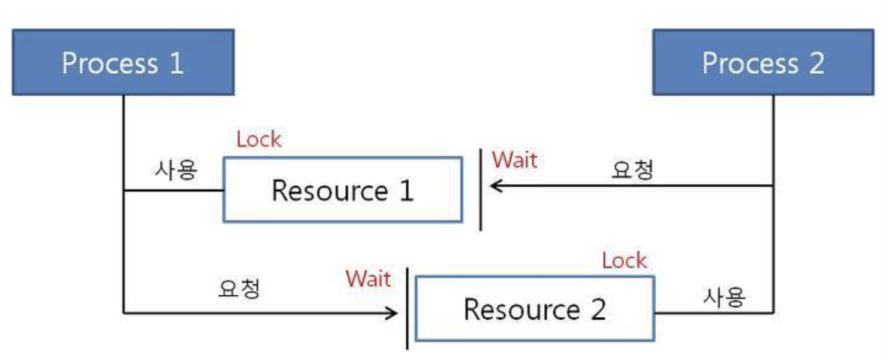

# 교착상태(Deadlock)란?

`교착상태`란 **상호배제**에 의해 다중 프로그래밍 시스템에서 여러 프로세스들이 공유하고 있는 일부 자원들을 **점유하고 놓지 않으면서 다른 프로세스가 갖고 있는 자원들을 요구하여 무한정으로 기다리고 있는 상태**를 말한다.

> **상호배제**란? 다중 프로그래밍 시스템에서 여러 프로세스들이 동시에 독립적으로 진행됨으로 인하여 발생하는 문제점을 해결하는 기법중 하나로, **둘 이상의 프로세스가 임계 영역에 동시에 접근하는 것을 금지시키는 방법**이다.

다음의 그림을 보면 이해가 빠를 것이다.

Process 1, 2와 공유 자원 Resource 1, 2가 존재한다고 가정하자.

Process 1이 Resource 1을 사용하며 Lock이 걸리고 동시에 Process 1이 Resource 2를 요청하며 대기(Wait)한다.

하지만 Process 2가 이미 Resource 2에 대한 선점을 진행하고 있는 상태이며, Process 2 또한 Resource 1의 사용을 요청하는 상태인 것이다.

결과적으로 어떤 프로세스가 자원을 요청했을 때, 그 시각에 그 자원을 사용할 수 없는 상황이 발생하게 되고 대기상태로 들어간 프로세스들이 실행 상태로 변경될 수 없게되며 `교착상태`가 발생하게 된다.

## 교착상태 필요조건 4가지

교착상태가 발생하기 위해서는 필요조건이 4가지 존재한다.

1. 상호배제(Mutual Exclusion)
  - **한 프로세스가 사용하는 자원은 다른 프로세스와 공유할 수 없는 자원이어야 한다.** 이러한 배타적인 자원은 임계구역으로 보호되기 때문에 다른 프로세스가 동시에 사용할 수 없다.
  - 위 그림처럼 한 자원에 대해 한 Process가 임계구역을 설정(Lock)하고 있기 때문에 다른 프로세스가 동시에 사용할 수 없는 교착 상태가 발생한다.
2. 비선점(non-preemption)
   - 한 프로세스가 사용중인 자원은 다른 프로세스가 **뺏을 수 없는 비선점 자원**이어야 한다.
   - 위 그림처럼 한 프로세스가 사용중인 자원은 프로세스가 끝나기 전까지 Lock을 풀지 않으며, 다른 프로세스가 계속해서 Wait하고 있다.
3. 점유와 대기(Hold and Wait)
  - 프로세스가 **자원을 가지고 있는 상태와 동시에 다른 프로세스가 갖고 있는 자원의 반납을 기다리고 있는 상태**이다.
4. 환형대기(Circular wait)
  - 각 프로세스가 **순환적**으로 다음 프로세스가 요구하는 자원을 갖고있는 상태이다.
  - 그림에서는 2개의 프로세스와 2개의 자원만이 예시로 나왔지만, 선형이 아닌 원형을 이루게 되어 프로세스의 자원 할당에서 첫 번째 프로세스와 마지막 프로세스의 자원할당이 겹치게 되어 원형에 있는 모든 프로세스가 자원 할당을 받고자 기다리는 형태를 생각해보자.(꼬리물기)

## 교착상태 해결 방법

교착상태를 해결하는 방법에는 예방, 회피, 회복, 무시 4가지 방법이 있다.

이 4가지 중에서 가장 적합한 것을 골라서 필요조건 4가지 중에서 하나만 해결해도 교착상태는 해결된다.

필요할 때 찾아서 쓰도록 하자.