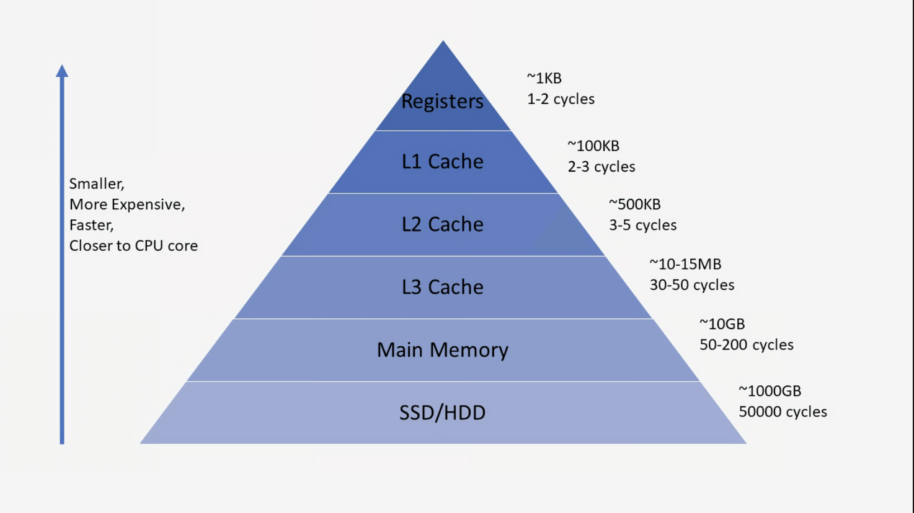
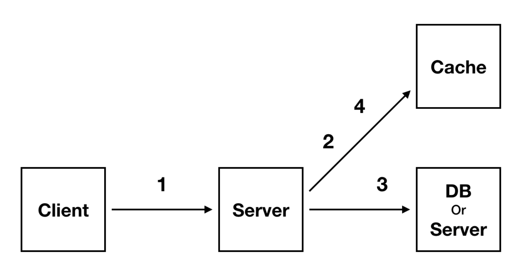

# 캐시(Cache)

> 캐시 또는 캐시 메모리는 자주 사용하는 데이터나 값을 저장해두어 속도를 빠르게 하는 임시 장소(메모리)이다.

아래와 같은 저장공간 계층 구조에서 확인할 수 있듯이, 캐시는 **저장 공간이 작고 비용이 비싼** 대신에 **빠른 성능**을 제공한다.

## 캐시(Cache)의 등장

Cache란 **나중에 요청할 결과를 미리 저장해둔 후 빠르게 서비스 해주는 것**을 위한 메모리이다. 즉, 미리 결과를 저장하고 나중에 동일한 요청이 오면 그 요청에 대해서 DB나 API를 참조하지 않고 Cache에 접근하여 요청을 처리하게 되는 것이다.

하지만 **모든 결과를 캐싱할 필요는 없으며**, 서비스할 때 많이 사용되는 `20%` 정도를 캐싱한다면 전체적으로 영향을 주어 효율을 극대화할 수 있다는 것이다.

## 어떤 정보를 캐시(Cache)에 담는가?

모든 데이터를 캐시에 담기에는 캐시라는 저장 공간은 매우 작다. 따라서 소수의 데이터를 선별해야 한다. 이 때 사용되는 캐시의 특징이 `지역성`이다.

## 시간 지역성

특정 데이터가 한번 접근되었을 경우, **가까운 미래에 또 한번 데이터에 접근할 가능성이 높은** 것을 말한다. 메모리 상의 같은 주소에 여러 차례 쓰기를 수행할 경우 상대적으로 작은 크기의 캐시를 사용해도 효율성을 꾀할 수 있다.

## 공간 지역성

특정 데이터와 **가까운 주소가 순서대로 접근되었을 경우**를 공간 지역성이라고 한다. CPU 캐시나 디스크 캐시의 경우 한 메모리 주소에 접근할 때 그 주소뿐 아니라 해당 블록을 전부 캐시에 가져오게 된다. 이 때 메모리 주소를 오름차순이나 내림차순으로 접근한다면, 캐시에 이미 저장된 같은 블록의 데이터에 접근하게 되므로 캐시의 효율성이 크게 향상된다.

## 캐시의 사용 구조

1. Client가 Server로 요청을 보낸다.
2. Server는 Cache에서 Client의 요청에 해당하는 데이터가 있는지 찾는다.
3. Cache에 데이터가 있다면 찾은 데이터를 Client에게 반환하고. 없다면 실제 DB에서 데이터를 찾는다.
4. 실제 DB에서 데이터를 찾았다면 Cache에 저장하고 Client에게 데이터를 반환한다.

## 캐시(Cache)를 많이 사용하는 이유

컴퓨터를 구성하는 메모리 저장공간은 속도가 빠를수록 용량이 작고 가격이 높다.

사용자들은 서비스를 사용할 때 좋은 사용자 경험을 원하고 빠른 렌더링을 원한다.

따라서 빠른 사용자 경험을 위해서 캐시를 사용하는 것이 탁월한 선택인 경우가 많다.

하지만 가격때문에 캐시에 저장할 적은 양의 정보를 잘 선택하는 것이 비용도 절약하고 효율을 높이는 방법이 될 것이다.