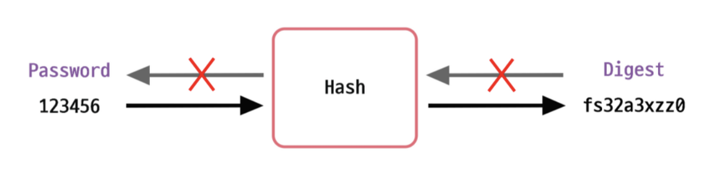

# 패스워드 암호화 방법

패스워드 암호화 방법에는 여러가지가 존재하는데 대표적으로 다음과 같다.

- 단순 텍스트
- 단방향 해시 함수(one-way hash function)의 다이제스트(digest)
  - 키 스트레칭
  - 솔팅

## 단방향 해시 함수(one-way hash function)의 다이제스트(digest)

단방향 해시 함수는 어떤 수학적 연산(또는 알고리즘)에 의해 원본 데이터를 매핑시켜 **완전히 다른 암호화된 데이터로 변환**시키는 것을 의미한다. 이 변환을 `해시`라고 하고, 해시에 의해 암호화된 데이터를 `다이제스트(digest)`라고 한다.

해싱은 단방향이다. 한마디로 단방향 해시 함수는 다이제스트를 복호화, 즉 원본 데이터를 구할 수는 없어야 한다. 말 그래도 단방향성이다.

세계에서 가장 인기있는 비밀번호인 123456을 예로 들어보자.



즉 원본 메시지 123456을 해시 함수에 돌려서 다이제스트인 fs32a3xzz0을 생성하고 해당 데이터를 DB에 저장하는 것이다.

이렇게 저장된 다이제스트는 설령 DB가 털린다고 하더라도 fs32a3xzz0은 단방향으로 해싱된 문자라 복호화할 수가 없는 것이다.

이러한 단방향 해시 함수의 종류들은 매우 많다. 대표적으로 아래와 같은 알고리즘들이 존재한다.

- SHA
- MD
- HAS
- WHIRLPOOL

그 중 가장 대표적인 해시 알고리즘인 SHA-256을 통해 123456을 해싱하면 다음과 같이 결과가 나온다.

```text
8d969eef6ecad3c29a3a629280e686cf0c3f5d5a86aff3ca12020c923adc6c92
```

만약 조금만 변경하여 123456 다음에 마침표(.) 하나만 더 찍어도 완전히 다른 값이 나온다.

```text
43fae6c11d7632acc6059de1cced9b09a58caaa878071308ad67f32ef6b11691
```

이렇게 사용자로부터 입력받은 정보를 그대로 저장하는게 아니라 해싱을 해서 저장하는 것이다. 그러면 DB를 털어 저런 값을 얻었다고 한들 기존 원래 패스워드를 유추하기 힘들게 된다.

### 단방향 해시 함수(one-way hash function)의 다이제스트(digest)의 문제점

- 인식 가능성
  - **동일한 메시지는 동일한 다이제스트 값을 가진다.** -> **원본을 유추가 가능**하다.
  - 레인보우 공격(rainbow attack): 공격자가 전처리(pre-computing)된 다이제스트를 가능한 한 많이 확보한 다음 이를 탈취한 다이제스트와 비교해 원본 메시지를 찾아내거나 동일한 효과의 메시지를 찾을 수 있다.
  - 이와 같은 다이제스트 목록을 레인보우 테이블이라고 하고, 이와 같은 공격 방식을 레인보우 공격이라고 한다.
- 속도
  - 해시 함수는 원래 암호화가 아닌 데이터 검색을 빠르게 하기 위해 설계된 것이다.
  - 해시 함수의 빠른 처리 속도로 인해 공격자는 **매우 빠른 속도로 임의의 문자열의 다이제스트와 해킹할 대상의 다이제스트를 비교할 수 있다.**

## 키 스트레칭(key stretching)

- **여러 단계의 해시 함수를 적용**하여 다이제스트를 생성하는 과정이다.
- 잘 설계된 패스워드 저장 시스템에서는 하나의 다이제스트를 생성할 때 어느 정도(일반적인 장비에서 0.2초 이상)의 시간이 소요되게 설정한다.
  - 브루트포스 공격으로 **패스워드를 추측하는 데 많은 시간이 소요되도록 하기 위한 것**이다.

## 솔팅(salting)

- 솔팅(salting): **해시 함수를 돌리기 전에 원문에 임의의 문자열을 덧붙이는 기법**을 의미한다.
- 솔트(salt): 단방향 해시 함수에서 다이제스트를 생성할 때 **추가하는 바이트 단위의 임의의 문자열**이다.
- 장점
  - (솔트+패스워드)의 다이제스트를 데이터베이스에 저장하고, 사용자가 로그인할 때 입력한 패스워드를 해시하여 일치 여부를 확인할 수 있다.
  - 솔트가 추가된 레인보우 테이블을 새로 생성하여 원래 데이터를 유추하기에는 큰 데이터가 필요하다. 이 때문에 해킹 시도를 방지해준다.
  - 사용자별로 다른 솔트를 사용한다면 동일한 패스워드를 사용하는 사용자의 다이제스트가 다르게 생성되어 인식 가능성 문제가 크게 개선된다.


