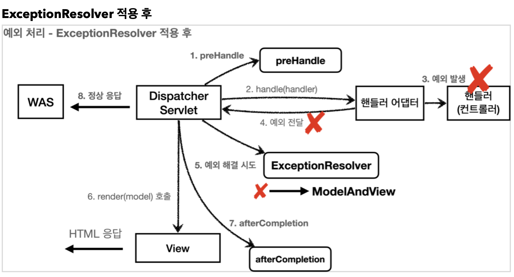

# Api Exception

## ExceptionResolver

- 서버 내부적으로 예외를 잡아서 정상 응답으로 클라이언트에게 전달하는 것을 의미한다.
- `ExceptionResolver`가 없다면 서버 내부에서 예외가 발생한다면 **[500]Internal Server Error**를 발생시켜 클라이언트에게 응답하게 된다.
- 다음과 같이 핸들러(컨트롤러)에서 예외가 발생한다면 `Dispatcher Servlet`이 받아서 등록되어있는 `ExceptionResolver`들 중에서 예외를 처리할 수 있는 `ExceptionResolver`가 있다면 `ExceptionResolver`에게 처리하도록 시킨다.
    - 이 때, 예외를 처리하고 마지막에 **빈** `ModelAndView` **객체를 반환**하여 서버 내부적으로 정상적인 흐름을 만들어 준다.



### 스프링이 기본적으로 제공하는 ExceptionResolver

<aside>
💡 다음 순서대로 우선순위가 높다.

</aside>

1. ExceptionHandlerExceptionResolver
    - @ExceptionHandler 를 처리한다.
    - API 예외처리는 대부분 이 기능을 사용하여 해결한다.
2. ResponseStatusExceptionResolver
    - HTTP 상태코드를 지정해준다.
    
    ```java
    @ResponseStatus(value = HttpStatus.NOT_FOUND)
    ```
    
3. DefaultHandlerExceptionResolver
    - 스프링 내부 기본 예외를 처리한다.